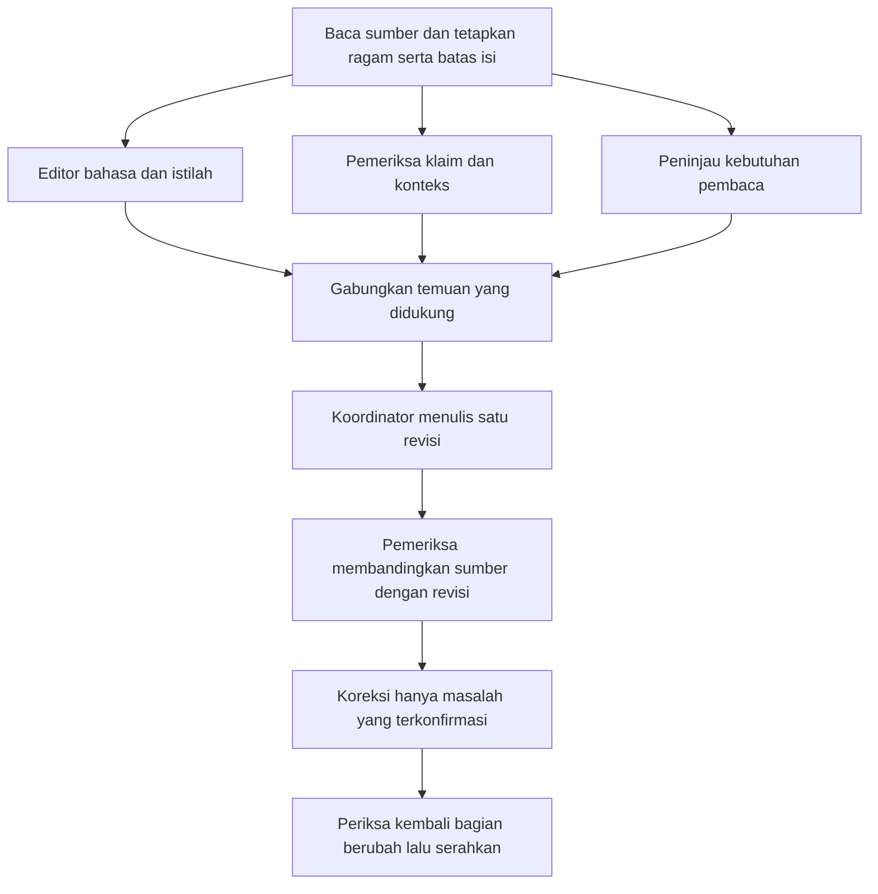

# Orkestrasi pakar dan Graph of Agents

## Batas istilah

“Mixture of Experts” di sini diterapkan sebagai pembagian sudut pemeriksaan, bukan klaim mengganti arsitektur neural model. Mixture-of-Agents pada Wang dkk. adalah pendekatan agregasi keluaran beberapa agen; Graph of Thoughts Besta dkk. memodelkan dependensi antarunit informasi. Keduanya menginformasikan desain, bukan membuktikan bahwa skill ini unggul untuk bahasa Indonesia. Lihat [sumber](sources.md).

## Pengaturan penalaran

Pengguna menginginkan extra-high reasoning. Jika host memiliki field yang didokumentasikan, preferensikan `xhigh` untuk penugasan yang mendukungnya. Warisi model aktif; tidak perlu memilih vendor/model lain atau mengubah pengaturan global. Tidak ada field `reasoning_effort` generik yang boleh dibuat sendiri di metadata skill.

Jika tidak ada kendali yang tersedia, tetap lakukan analisis menyeluruh dan verifikasi berurutan; jangan mengklaim telah mengaktifkan xhigh. Bedakan preferensi di instruksi dari bukti pengaturan tool. Batas slot, waktu, biaya, dan pilihan pengguna tetap berlaku.

## Graf untuk revisi substantif

Untuk satu paragraf sederhana, kerjakan peran yang relevan dalam satu agen; jangan membuat tiga agen yang sekadar mengulang tugas. Untuk bab/dokumen panjang, revisi kompleks, atau permintaan eksplisit kolaborasi, gunakan subagen nyata bila tersedia dan berguna. Jika slot terbatas, jalankan dua pemeriksa paralel dan koordinator, lalu gunakan agen pemeriksa setelah draf ada. Jangan mengirim pesan ke orang lain atau membuat task pengguna baru untuk mensimulasikan subagen.

## Kontrak tugas

Berikan setiap agen potongan sumber beserta konteks tetangga, profil ragam, glosarium bersama, informasi mana yang boleh diubah, dan jenis temuan yang diminta. Jangan memberi isi pribadi yang tidak diperlukan. Semua agen bekerja pada sumber yang sama versinya. Hanya koordinator menulis revisi final; pekerja memberi temuan atau membuat draf di lokasi terpisah agar tidak saling menimpa.

- **Editor bahasa/istilah:** kejelasan, EYD jika sesuai, frasa kaku, istilah Inggris, ritme, dan pengecualian yang perlu dijaga.
- **Pemeriksa klaim/konteks:** angka dan pasangannya, sitasi serta cakupan dukungan, negasi, status waktu, kausalitas, ketidakpastian, dan informasi hilang.
- **Peninjau pembaca:** apakah nada, tujuan, panjang penjelasan, dan suara sesuai; mana yang sudah baik dan perlu dipertahankan.
- **Verifier revisi:** terima sumber asli dan revisi, bukan hanya daftar keluhan sebelumnya. Cari perubahan makna dan perubahan gaya yang justru memperburuk teks.

Format hasil ringkas: `lokasi; jenis masalah; bukti pendek; dampak; perbaikan minimum; keyakinan/batas akses`. Tidak perlu menampilkan rantai penalaran internal.

## Menggabungkan dan menghentikan

Tunggu cabang yang diperlukan sebelum keputusan bergantung pada hasilnya. Pilih berdasarkan sumber, makna, pedoman yang berlaku, dan pilihan pengguna; voting tidak dapat membenarkan perubahan fakta. Perbedaan selera dapat diselesaikan dengan pilihan yang paling sedikit mengganggu suara penulis. Jangan merata-ratakan dua versi yang bertentangan.

Setelah pemeriksaan, perbaiki masalah konkret dan cek ulang bagian yang berubah. Lanjutkan putaran hanya jika masih ada risiko isi yang dapat diatasi; jangan berputar untuk mengejar skor “lebih manusia”. Jika bukti untuk suatu bagian tidak tersedia, pertahankan bagian itu atau tandai ketidakpastian dan selesaikan bagian lain.

Jika tool subagen tidak tersedia, gunakan tahapan ini secara berurutan dan laporkan sebagai review satu agen. Sebut “review independen” hanya ketika benar-benar ada agen lain yang memeriksa dengan konteks yang memadai. Jangan mengklaim seluruh dokumen diperiksa jika konteks yang dibagikan hanya beberapa bagian.
