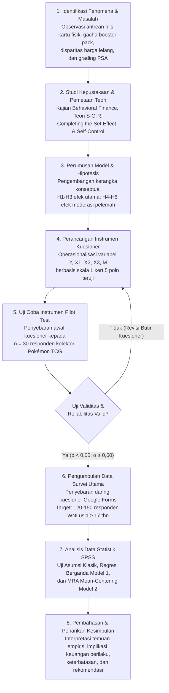

# PROPOSAL SKRIPSI LENGKAP — UNIVERSITAS KRISTEN KRIDA WACANA
**Fakultas Ekonomi dan Bisnis | Program Studi S1 Manajemen**  
**Konsentrasi:** Manajemen Keuangan  
**Penulis:** Arthur Reezan (NIM: 312023002)  
**Dosen Pembimbing:** Dr. Fredella Colline, S.E., M.M., CFP®, PFM, CHCP-A (NIDN: [NIDN_DOSEN])  

> **Judul Proposal Skripsi:**  
> **PENGARUH *HEDONIC MOTIVATION*, *DESIRE FOR COMPLETENESS*, DAN *SPECULATIVE MOTIVE* TERHADAP *IMPULSIVE BUYING* BOOSTER PACK KARTU POKÉMON TCG DENGAN *SELF-CONTROL* SEBAGAI VARIABEL MODERASI**  
>  
> *Format Dokumen: Teks Lengkap Proposal BAB 1–3 Sesuai Buku Pedoman Penyusunan Tugas Akhir FEB UKRIDA 2023 (Lampiran 10 Model B)*

---

## DAFTAR ISI NASKAH PROPOSAL

- [HALAMAN SAMPUL / JUDUL PROPOSAL](#halaman-sampul--judul-proposal)
- [HALAMAN PERNYATAAN KEASLIAN](#halaman-pernyataan-keaslian)
- [HALAMAN PERSETUJUAN PROPOSAL SKRIPSI](#halaman-persetujuan-proposal-skripsi)
- [HALAMAN PENGESAHAN TIM PENGUJI SEMINAR PROPOSAL](#halaman-pengesahan-tim-penguji-seminar-proposal)
- [KATA PENGANTAR](#kata-pengantar)
- [ABSTRAK (BAHASA INDONESIA)](#abstrak)
- [ABSTRACT (ENGLISH)](#abstract)
- [BAB 1 PENDAHULUAN](#bab-1-pendahuluan)
  - [1.1 Latar Belakang Penelitian](#11-latar-belakang-penelitian)
  - [1.2 Perumusan Masalah](#12-perumusan-masalah)
  - [1.3 Tujuan Penelitian](#13-tujuan-penelitian)
  - [1.4 Manfaat Penelitian](#14-manfaat-penelitian)
    - [1.4.1 Manfaat Teoritis](#141-manfaat-teoritis)
    - [1.4.2 Manfaat Praktis](#142-manfaat-praktis)
- [BAB 2 KAJIAN PUSTAKA DAN PENGEMBANGAN HIPOTESIS](#bab-2-kajian-pustaka-dan-pengembangan-hipotesis)
  - [2.1 Landasan Teori](#21-landasan-teori)
    - [2.1.1 Grand Theory: Keuangan Perilaku (Behavioral Finance)](#211-grand-theory-keuangan-perilaku-behavioral-finance)
    - [2.1.2 Teori Pendukung (Supporting Theories)](#212-teori-pendukung-supporting-theories)
    - [2.1.3 Impulsive Buying (Pembelian Impulsif)](#213-impulsive-buying-pembelian-impulsif)
    - [2.1.4 Hedonic Motivation (Motivasi Hedonis)](#214-hedonic-motivation-motivasi-hedonis)
    - [2.1.5 Desire for Completeness (Hasrat Melengkapi Koleksi)](#215-desire-for-completeness-hasrat-melengkapi-koleksi)
    - [2.1.6 Speculative Motive (Motif Spekulasi Finansial)](#216-speculative-motive-motif-spekulasi-finansial)
    - [2.1.7 Self-Control (Kontrol Diri)](#217-self-control-kontrol-diri)
  - [2.2 Penelitian Sebelumnya](#22-penelitian-sebelumnya)
  - [2.3 Pengembangan Hipotesis](#23-pengembangan-hipotesis)
    - [2.3.1 Pengaruh Hedonic Motivation terhadap Impulsive Buying](#231-pengaruh-hedonic-motivation-terhadap-impulsive-buying)
    - [2.3.2 Pengaruh Desire for Completeness terhadap Impulsive Buying](#232-pengaruh-desire-for-completeness-terhadap-impulsive-buying)
    - [2.3.3 Pengaruh Speculative Motive terhadap Impulsive Buying](#233-pengaruh-speculative-motive-terhadap-impulsive-buying)
    - [2.3.4 Peran Moderasi Self-Control pada Pengaruh Hedonic Motivation terhadap Impulsive Buying](#234-peran-moderasi-self-control-pada-pengaruh-hedonic-motivation-terhadap-impulsive-buying)
    - [2.3.5 Peran Moderasi Self-Control pada Pengaruh Desire for Completeness terhadap Impulsive Buying](#235-peran-moderasi-self-control-pada-pengaruh-desire-for-completeness-terhadap-impulsive-buying)
    - [2.3.6 Peran Moderasi Self-Control pada Pengaruh Speculative Motive terhadap Impulsive Buying](#236-peran-moderasi-self-control-pada-pengaruh-speculative-motive-terhadap-impulsive-buying)
  - [2.4 Rerangka Penelitian](#24-rerangka-penelitian)
- [BAB 3 METODE PENELITIAN](#bab-3-metode-penelitian)
  - [3.1 Jenis dan Sumber Data](#31-jenis-dan-sumber-data)
  - [3.2 Populasi dan Sampel](#32-populasi-dan-sampel)
    - [3.2.1 Populasi](#321-populasi)
    - [3.2.2 Sampel dan Penentuan Ukuran Sampel](#322-sampel-dan-penentuan-ukuran-sampel)
  - [3.3 Model Penelitian](#33-model-penelitian)
  - [3.4 Operasionalisasi Variabel](#34-operasionalisasi-variabel)
  - [3.5 Metode Analisis Data](#35-metode-analisis-data)
    - [3.5.1 Uji Kualitas Data (Validitas dan Reliabilitas)](#351-uji-kualitas-data-validitas-dan-reliabilitas)
    - [3.5.2 Uji Asumsi Klasik](#352-uji-asumsi-klasik)
    - [3.5.3 Analisis Regresi Linear Berganda (Model 1)](#353-analisis-regresi-linear-berganda-model-1)
    - [3.5.4 Moderated Regression Analysis (MRA) (Model 2)](#354-moderated-regression-analysis-mra-model-2)
    - [3.5.5 Uji Kelayakan Model (Goodness of Fit)](#355-uji-kelayakan-model-goodness-of-fit)
    - [3.5.6 Uji Signifikansi Parsial (Uji t)](#356-uji-signifikansi-parsial-uji-t)
- [DAFTAR PUSTAKA](#daftar-pustaka)

---

### HALAMAN SAMPUL / JUDUL PROPOSAL

<div align="center">

# PROPOSAL SKRIPSI

## PENGARUH *HEDONIC MOTIVATION*, *DESIRE FOR COMPLETENESS*, DAN *SPECULATIVE MOTIVE* TERHADAP *IMPULSIVE BUYING* BOOSTER PACK KARTU POKÉMON TCG DENGAN *SELF-CONTROL* SEBAGAI VARIABEL MODERASI

Diajukan Kepada Program Studi S1 Manajemen  
Untuk Menyusun Skripsi Sarjana Manajemen (S.M.)  

Diajukan Oleh:  
**Arthur Reezan**  
**NIM: 312023002**  

### FAKULTAS EKONOMI DAN BISNIS  
### UNIVERSITAS KRISTEN KRIDA WACANA  
### JAKARTA  
### 2026

</div>

---

### HALAMAN PERNYATAAN KEASLIAN

<div align="center">

### PERNYATAAN KEASLIAN KARYA TUGAS AKHIR

</div>

Saya mahasiswa Universitas Kristen Krida Wacana:

| Identitas | Keterangan |
|:---|:---|
| Nama Mahasiswa | Arthur Reezan |
| NIM | 312023002 |
| Program Studi | Program Studi S1 Manajemen |
| Konsentrasi | Manajemen Keuangan |

Dengan ini menyatakan dengan sesungguhnya bahwa Proposal Skripsi yang berjudul:

> **"PENGARUH *HEDONIC MOTIVATION*, *DESIRE FOR COMPLETENESS*, DAN *SPECULATIVE MOTIVE* TERHADAP *IMPULSIVE BUYING* BOOSTER PACK KARTU POKÉMON TCG DENGAN *SELF-CONTROL* SEBAGAI VARIABEL MODERASI"**

adalah:
1. Benar-benar hasil karya saya sendiri, bukan merupakan jiplakan, plagiarisme, fabrikasi, atau tiruan dari karya tulis ilmiah orang lain yang pernah diajukan untuk memperoleh gelar akademik di perguruan tinggi manapun.
2. Seluruh kutipan, data, dan rujukan ilmiah yang digunakan dalam naskah ini telah dicantumkan sumbernya secara jelas dan lengkap sesuai dengan kaidah penulisan ilmiah yang berlaku di Universitas Kristen Krida Wacana.
3. Apabila di kemudian hari terbukti bahwa pernyataan ini tidak benar atau ditemukan indikasi plagiarisme, saya bersedia menerima sanksi akademik yang berlaku sesuai dengan peraturan perundang-undangan dan ketentuan di lingkungan Universitas Kristen Krida Wacana.

Jakarta, __________________ 2026  
Yang menyatakan,  

| [ Materai Rp10.000 ] | **Arthur Reezan**<br>NIM: 312023002 |
|---|---|

---

### HALAMAN PERSETUJUAN PROPOSAL SKRIPSI
*(Format Baku Sesuai Lampiran 2 Pedoman Tugas Akhir FEB UKRIDA 2023)*

<div align="center">

### PERSETUJUAN PROPOSAL SKRIPSI

</div>

| Identitas | Keterangan |
|:---|:---|
| Nama | Arthur Reezan |
| N.I.M. | 312023002 |
| Program Studi | Program Studi S1 Manajemen |
| Konsentrasi | Manajemen Keuangan |

**Judul yang Diajukan:**  
**PENGARUH *HEDONIC MOTIVATION*, *DESIRE FOR COMPLETENESS*, DAN *SPECULATIVE MOTIVE* TERHADAP *IMPULSIVE BUYING* BOOSTER PACK KARTU POKÉMON TCG DENGAN *SELF-CONTROL* SEBAGAI VARIABEL MODERASI**  

Jakarta, __________________ 2026  

Menyetujui,

| Dosen Pembimbing | Dosen Pendamping |
|:---|:---|
| <br><br><br>**Dr. Fredella Colline, S.E., M.M., CFP®, PFM, CHCP-A**<br>NIDN: [NIDN_DOSEN] | <br><br><br>( ____________________________________ )<br>&nbsp; |

Mengetahui,  
Ketua Program Studi S1 Manajemen  

<br><br>**Rita Amelinda, S.E., M.M.**  
NIDN: 0323047201  

---

### HALAMAN PENGESAHAN TIM PENGUJI SEMINAR PROPOSAL

<div align="center">

### PENGESAHAN TIM PENGUJI SEMINAR PROPOSAL SKRIPSI

Proposal Skripsi dengan Judul:  
**PENGARUH *HEDONIC MOTIVATION*, *DESIRE FOR COMPLETENESS*, DAN *SPECULATIVE MOTIVE* TERHADAP *IMPULSIVE BUYING* BOOSTER PACK KARTU POKÉMON TCG DENGAN *SELF-CONTROL* SEBAGAI VARIABEL MODERASI**  

Diajukan Oleh:  
**Arthur Reezan**  
**(312023002)**  

</div>

Telah dipertahankan di hadapan Tim Penguji Seminar Proposal Skripsi Program Studi S1 Manajemen Fakultas Ekonomi dan Bisnis Universitas Kristen Krida Wacana pada:

**Hari / Tanggal Seminar:** __________________________, _____________________ 2026  

**Tim Penguji Seminar Proposal:**

| No | Peran Penguji | Nama Dosen | Tanda Tangan |
|:---|:---|:---|:---|
| 1. | Ketua Penguji | __________________________________________ | ( ______________________ ) |
| 2. | Anggota Penguji | __________________________________________ | ( ______________________ ) |
| 3. | Dosen Pembimbing | Dr. Fredella Colline, S.E., M.M., CFP®, PFM, CHCP-A | ( ______________________ ) |

---

### KATA PENGANTAR

Puji dan syukur penulis panjatkan ke hadirat Tuhan Yang Maha Esa atas kasih, anugerah, dan penyertaan-Nya yang senantiasa melimpah, sehingga penulis dapat menyelesaikan penyusunan proposal skripsi yang berjudul **“PENGARUH *HEDONIC MOTIVATION*, *DESIRE FOR COMPLETENESS*, DAN *SPECULATIVE MOTIVE* TERHADAP *IMPULSIVE BUYING* BOOSTER PACK KARTU POKÉMON TCG DENGAN *SELF-CONTROL* SEBAGAI VARIABEL MODERASI”** dengan baik, lancar, dan tepat waktu.

Proposal skripsi ini disusun sebagai salah satu tahapan akademik yang diwajibkan dalam rangka menempuh ujian seminar proposal guna menyelesaikan studi pada Program Studi S1 Manajemen, Konsentrasi Manajemen Keuangan, Fakultas Ekonomi dan Bisnis, Universitas Kristen Krida Wacana (UKRIDA), Jakarta.

Dalam proses penyusunan naskah proposal ini, penulis mendapatkan banyak bimbingan, arahan metodologis, dukungan moril, serta fasilitas dari berbagai pihak. Oleh karena itu, dengan penuh rasa hormat dan kerendahan hati, penulis menyampaikan terima kasih dan apresiasi yang setinggi-tingginya kepada:

1. **Dr. Fredella Colline, S.E., M.M., CFP®, PFM, CHCP-A**, selaku Dosen Pembimbing Skripsi, yang telah dengan luar biasa sabar, teliti, kritis, dan penuh dedikasi meluangkan waktu serta mencurahkan tenaga dan pikiran dalam membimbing, mengarahkan, dan menyempurnakan naskah proposal ini sejak tahap awal perumusan gagasan hingga penyusunan naskah komprehensif.
2. **Rita Amelinda, S.E., M.M.**, selaku Ketua Program Studi S1 Manajemen FEB UKRIDA, atas segala arahan, kemudahan proses administratif, dan bimbingan akademik yang diberikan.
3. **Bapak dan Ibu Dosen Penguji Seminar Proposal**, yang telah bersedia meluangkan waktu untuk menguji, memberikan koreksi kritis, serta masukan yang konstruktif guna menyempurnakan naskah penelitian ini.
4. **Seluruh Dosen dan Staf Pengajar FEB UKRIDA**, yang telah membagikan ilmu pengetahuan, wawasan analisis keuangan, serta etika profesional selama masa perkuliahan penulis.
5. **Kedua Orang Tua dan Keluarga Tercinta**, atas doa yang tiada putus, limpahan kasih sayang, ketulusan pengorbanan, serta dorongan moral dan material yang menjadi sumber kekuatan utama bagi penulis.
6. **Rekan-rekan Mahasiswa Manajemen FEB UKRIDA Angkatan 2023** dan sahabat seperjuangan, atas diskusi yang membangun, motivasi, dan kerja sama selama proses perkuliahan.
7. **Komunitas Kolektor dan Pemain Pokémon TCG di Indonesia**, yang telah memberikan gambaran nyata mengenai fenomena pasar kartu koleksi di lapangan.

Penulis menyadari bahwa proposal ini masih jauh dari kesempurnaan. Kritik dan saran yang membangun sangat diharapkan demi penyempurnaan karya ilmiah ini ke depan. Semoga proposal skripsi ini dapat memberikan manfaat akademis dan praktis bagi perkembangan kajian ilmu manajemen keuangan perilaku di Indonesia.

Jakarta, __________________ 2026  
**Penulis**  
<br><br>**Arthur Reezan**  
NIM: 312023002  

---

### ABSTRAK

Penelitian ini bertujuan untuk menganalisis dan menguji secara empiris pengaruh *hedonic motivation* (motivasi hedonis), *desire for completeness* (hasrat melengkapi koleksi), dan *speculative motive* (motif spekulasi finansial) terhadap *impulsive buying* (pembelian impulsif) *booster pack* kartu Pokémon Trading Card Game (Pokémon TCG) fisik berbahasa Indonesia, serta menguji peran *self-control* (kontrol diri) sebagai variabel moderasi dalam memperlemah pengaruh ketiga variabel anteseden tersebut.

Penelitian ini menggunakan pendekatan kuantitatif asosiatif dengan desain survei *cross-sectional*. Data primer dikumpulkan melalui penyebaran kuesioner daring berbasis skala Likert 5 poin kepada responden yang dipilih melalui teknik *purposive sampling*. Kriteria inklusi sampel adalah konsumen atau kolektor Warga Negara Indonesia (WNI) berusia minimal 17 tahun yang pernah membeli *booster pack* Pokémon TCG fisik resmi dalam rentang waktu 6–12 bulan terakhir. Jumlah sampel yang ditargetkan adalah 120 hingga 150 responden, mengacu pada rekomendasi ukuran sampel Green (1991) dan Cohen (1988) untuk mencapai kekuatan uji statistik (*statistical power*) yang memadai pada model regresi linear berganda. Metode analisis data menggunakan analisis regresi berganda dan *Moderated Regression Analysis* (MRA) dengan prosedur standarisasi skor rata-rata (*mean-centering*) guna mengatasi potensi multikolinearitas struktural antar-istilah interaksi (Aiken & West, 1991; Ghozali, 2018), yang diolah menggunakan perangkat lunak SPSS.

Penelitian ini menawarkan kebaruan teoritis (*novelty*) dengan mengintegrasikan kerangka *Behavioral Finance* sebagai *Grand Theory*, didukung paradigma *Stimulus-Organism-Response* (S-O-R), *The Completing the Set Effect* / *Zeigarnik Effect*, serta *Self-Regulation Theory* pada fenomena komoditas hobi fisik bernilai spekulatif tinggi. Hasil penelitian ini diharapkan memberikan kontribusi empiris bagi konsumen muda dalam mengelola alokasi pengeluaran gaya hidup, serta masukan aplikatif bagi otoritas perencana keuangan dalam merancang edukasi pengelolaan keuangan perilaku yang kontekstual bagi Generasi Z.

**Kata Kunci:** *Impulsive Buying*, *Hedonic Motivation*, *Desire for Completeness*, *Speculative Motive*, *Self-Control*, *Moderated Regression Analysis*, Pokémon TCG, Keuangan Perilaku (*Behavioral Finance*).

---

### ABSTRACT

*This research aims to analyze and empirically test the effects of hedonic motivation, desire for completeness, and speculative motive on the impulsive buying behavior of official Indonesian-language physical Pokémon Trading Card Game (Pokémon TCG) booster packs, as well as to evaluate the moderating role of self-control in weakening the relationships between these three antecedent variables and impulsive buying.*

*This study adopts an associative quantitative approach utilizing a cross-sectional survey design. Primary data are gathered via self-administered online questionnaires employing a 5-point Likert scale, distributed to respondents selected through purposive sampling. The sample inclusion criteria comprise Indonesian citizens aged 17 and above who have purchased official physical booster packs within the past 6 to 12 months. The targeted sample size ranges from 120 to 150 respondents, consistent with the statistical power criteria established by Green (1991) and Cohen (1988) for multiple regression frameworks. The empirical model is estimated using multiple linear regression and Moderated Regression Analysis (MRA) with mean-centering procedures to eliminate structural multicollinearity (Aiken & West, 1991; Ghozali, 2018), executed via SPSS software.*

*This study provides theoretical novelty by synthesizing Behavioral Finance as the Grand Theory, supported by the Stimulus-Organism-Response (S-O-R) paradigm, the Completing the Set Effect / Zeigarnik Effect, and Self-Regulation Theory in the context of tangible alternative hobby assets exhibiting secondary market speculative premiums. The findings are expected to offer practical insights for young consumers in exercising self-regulatory discipline regarding discretionary collectibles and provide strategic inputs for financial planners in formulating contextual behavioral financial management programs for Generation Z.*

***Keywords:*** *Impulsive Buying, Hedonic Motivation, Desire for Completeness, Speculative Motive, Self-Control, Moderated Regression Analysis, Pokémon TCG, Behavioral Finance.*

| Mahasiswa | Dosen Pembimbing |
|:---|:---|
| <br><br>**Arthur Reezan**<br>NIM: 312023002 | <br><br>**Dr. Fredella Colline, S.E., M.M., CFP®, PFM, CHCP-A**<br>NIDN: [NIDN_DOSEN] |

---

# BAB 1 PENDAHULUAN

## 1.1 Latar Belakang Penelitian

Waralaba media (*media franchise*) Pokémon yang diciptakan oleh Satoshi Tajiri bersama Game Freak dan diluncurkan oleh Nintendo pada tahun 1996 di Jepang telah berkembang menjadi fenomena budaya pop global paling berpengaruh di dunia. Berdasarkan data agregasi industri media internasional, Pokémon dinobatkan sebagai waralaba media dengan pendapatan tertinggi sepanjang masa (*the highest-grossing media franchise in history*), dengan estimasi pendapatan kotor kumulatif melampaui US$ 100 miliar. Angka ini melampaui waralaba legendaris dunia lainnya seperti *Star Wars*, *Marvel Cinematic Universe*, maupun *Mickey Mouse*. Keberhasilan masif ini dibangun di atas fondasi ekosistem multimedia yang saling memperkuat:
1. **Lini Permainan Video (*Video Games*):** Dimulai dari RPG Generasi I (*Pokémon Red/Green/Blue*) di konsol Nintendo Game Boy hingga Generasi IX (*Pokémon Scarlet/Violet*) di Nintendo Switch, serta revolusi permainan seluler berbasis *Augmented Reality* *Pokémon GO* yang memecahkan rekor interaksi ratusan juta pemain global secara simultan, disusul inovasi digital mutakhir seperti *Pokémon Sleep*, *Pokémon UNITE*, dan *Pokémon Trading Card Game Pocket*.
2. **Lini Animasi dan Film Bioskop:** Serial televisi anime yang mengisahkan 25 tahun perjalanan Satoshi (Ash Ketchum) dan Pikachu yang telah ditayangkan di lebih dari 190 negara, deretan film layar lebar monumental seperti *Pokémon: The First Movie – Mewtwo Strikes Back* (1998) yang merajai *box office* dunia, film aksi langsung (*live-action*) Hollywood berpendapatan tinggi *Pokémon Detective Pikachu* (2019), hingga serial anime generasi terbaru *Pokémon Horizons*.
3. **Lini Lisensi, Merchandise, dan Gerai Ritel:** Jaringan gerai resmi *Pokémon Center* di berbagai kota metropolitan dunia serta penyelenggaraan turnamen tahunan bergengsi berskala internasional yakni *Pokémon World Championships*.

Di antara seluruh pilar ekosistem multimedia tersebut, **permainan kartu fisik atau *Pokémon Trading Card Game* (Pokémon TCG)** memegang peranan yang paling sentral, monumental, dan memiliki perputaran ekonomi koleksi fisik (*physical collectibles*) terbesar di dunia. Hingga tahun 2024, The Pokémon Company mencatat bahwa produksi kumulatif kartu Pokémon fisik telah menembus lebih dari 52,9 miliar lembar kartu yang didistribusikan ke 93 wilayah dan diterjemahkan ke dalam 14 bahasa. Kartu Pokémon bukan lagi sekadar alat permainan meja (*tabletop game*) anak-anak, melainkan telah bertransformasi menjadi **instrumen aset alternatif koleksi (*alternative collectibles asset*)** bernilai ekonomi tinggi yang diperdagangkan secara aktif oleh kalangan dewasa muda, investor hobi, dan balai lelang global.

Di Indonesia, kehadiran kartu resmi Pokémon TCG berbahasa Indonesia sejak tahun 2019 melalui The Pokémon Company bekerja sama dengan AKG Games (PT Adiperkasa Citra Lestari) mengalami akselerasi luar biasa. Strategi distribusinya sangat unik dan agresif: produk kartu tidak hanya dipasarkan melalui toko hobi khusus (*Local Game Stores* / LGS), melainkan didistribusikan secara masif di ribuan gerai jaringan ritel modern minimarket terkemuka (Indomaret, Alfamart, Gramedia, Toys Kingdom). Penempatan produk kartu langsung di etalase meja kasir ritel modern ini berhasil mendemokratisasi akses dan mengubah hobi kartu dari komunitas ceruk (*niche*) menjadi fenomena konsumsi populer berskala nasional. Minat masyarakat Indonesia—khususnya kalangan mahasiswa dan Generasi Z—terhadap kartu fisik ini didorong oleh konvergensi antara fungsi rekreasi permainan, prestise sosial, hobi mengoleksi kartu langka, serta motif spekulasi finansial.

Dinamika pasar Pokémon TCG fisik di Indonesia memunculkan fenomena perilaku konsumsi yang sangat unik sekaligus problematis. Produk kartu fisik dijual dalam format kemasan acak tertutup (*blind pack* atau *booster pack*) dengan harga eceran resmi yang sangat terjangkau, berkisar antara Rp20.000 hingga Rp30.000 per bungkus (berisi 5 lembar kartu acak). Namun, di dalam bungkus tersebut tersimpan peluang probabilitas untuk menarik kartu dengan tingkat kelangkaan tinggi (*Special Illustration Rare / SAR*, kartu *Super Rare / SR*, atau *Ultra Rare / UR*). Di pasar sekunder daring (Tokopedia, Shopee, grup lelang Facebook, dan komunitas media sosial), kartu-kartu berkarakter favorit (seperti Charizard, Pikachu, atau kartu pelatih wanita/waifu populer) diperjualbelikan dengan harga fantastis mulai dari ratusan ribu hingga puluhan juta rupiah per lembar.

Fenomena disparitas harga pasar sekunder ini diperkuat oleh keberadaan industri **sertifikasi penilaian kondisi fisik kartu (*card grading*)**. Lembaga grading independen berstandar internasional terkemuka seperti **PSA (*Professional Sports Authenticator*)**, **BGS (*Beckett Grading Services*)**, dan **CGC Cards** memeriksa integritas fisik kartu secara mikroskopis berdasarkan empat kriteria utama: *centering* (kesimetrisan cetak), *surface* (kebersihan permukaan tanpa goresan), *edges* (kerapian tepi), dan *corners* (ketajaman sudut kartu). Kartu yang memenuhi kesempurnaan tertinggi akan disegel permanen dalam wadah akrilik kedap udara (*tamper-evident slab*) dan diberi label skor kualitas 1 hingga 10 (*PSA 10 Gem Mint* atau *BGS 10 Pristine*). Kartu berpredikat *Gem Mint 10* secara instan bertransformasi menjadi aset terstandardisasi yang likuid di bursa lelang global dengan harga jual yang melonjak 5 kali hingga 50 kali lipat dibandingkan kartu mentah (*raw card*). Kehadiran pasar grading ini memicu gelombang spekulasi (*grading arbitrage*), di mana konsumen tergiur membeli *booster pack* murah dengan harapan menarik kartu berkondisi sempurna untuk digrade dan dijual kembali demi mendulang keuntungan modal (*capital gain*).

Disparitas nilai yang ekstrem dan mekanisme kemasan acak berbasis probabilitas (*gacha mechanism*) tersebut mendorong antusiasme transaksi yang berlebihan. Setiap kali ekspansi seri baru diluncurkan (seperti Seri 151, Kilau Hitam, atau Terastal), gerai ritel modern kerap diserbu antrean pembeli dan produk ludes terjual dalam hitungan jam. Banyak pembeli melakukan transaksi pembelian *booster pack* secara berulang-ulang, mendadak di kasir toko, dan tidak direncanakan sebelumnya dalam alokasi anggaran bulanan. Transaksi belanja yang tiba-tiba, didorong oleh letupan emosional sesaat, dan mengabaikan pertimbangan rasional ini mengindikasikan terjadinya gejala **pembelian impulsif (*impulsive buying*)** yang masif pada komoditas kartu Pokémon fisik di Indonesia.

Fenomena *impulsive buying* telah lama menjadi pusat perhatian utama dalam literatur perilaku konsumen dan psikologi ekonomi. Stern (1962) dalam karya klasiknya mengklasifikasikan pembelian impulsif ke dalam empat kategori: *pure impulse*, *reminder impulse*, *suggestion impulse*, dan *planned impulse buying*. Rook (1987) mendefinisikan *impulsive buying* sebagai desakan pembelian yang terjadi seketika, kuat, dan persisten tanpa adanya pertimbangan kognitif sadar sebelumnya mengenai konsekuensi pengeluaran. Lebih lanjut, Beatty dan Ferrell (1998) serta studi meta-analisis komprehensif oleh Amos et al. (2014) mengungkapkan bahwa keputusan pembelian impulsif sesungguhnya merupakan muara perilaku yang dipengaruhi oleh spektrum faktor penentu (*antecedents*) yang sangat luas dalam literatur ilmiah terdahulu:
1. **Faktor Emosional dan Afektif (*Affective Drivers*):** Meliputi motivasi berbelanja untuk kesenangan (*hedonic shopping motivations*), pencarian pelepasan stres dan petualangan (Babin et al., 1994; Arnold & Reynolds, 2003), suasana hati positif (*positive affect*), serta luapan kegembiraan sesaat (*excitement and arousal*) (Gültekin & Özer, 2012).
2. **Faktor Kognitif dan Psikologi Kolektor (*Cognitive and Collector Drivers*):** Meliputi ketegangan mental ketidaktuntasan himpunan (*Zeigarnik Effect*) (Zeigarnik, 1927), dorongan psikologis melengkapi set koleksi (*The Completing the Set Effect*) (Gao et al., 2014), pembingkaian himpunan semu (*Pseudo-Set Framing*) (Barasz et al., 2017), serta hasrat kepemilikan materialistik atas objek langka (Belk, 1995).
3. **Faktor Finansial dan Spekulasi Pasar (*Economic and Speculative Drivers*):** Meliputi ekspektasi apresiasi nilai modal (*capital gain*), likuiditas pasar sekunder, anomali psikologi pasar modal dan bias optimisme berlebihan (*overoptimism bias*) (Shiller, 2000; Baur et al., 2018), persepsi memenangkan lotre (*gambler's fallacy*), serta bias perilaku investor muda (Colline, 2024).
4. **Faktor Situasional dan Rangsangan Toko (*Situational and Atmospheric Drivers*):** Meliputi mekanisme kejutan kemasan tertutup (*blind pack mystery*), display etalase kasir yang memancing sentuhan fisik (*need for touch*) (Peck & Childers, 2006), diskon promosi sesaat, serta desakan kelangkaan stok fisik (Amos et al., 2014).

Berdasarkan pemetaan komprehensif faktor-faktor penentu *impulsive buying* dalam literatur di atas, penelitian ini secara deduktif memilih dan memfokuskan pada tiga variabel independen utama yang paling tepat merepresentasikan karakteristik intrinsik dan perilaku konsumsi komoditas kartu Pokémon TCG:
1. Pertama, **faktor afektif diwakili oleh *Hedonic Motivation* ($X_1$)**. Konsumen membeli *booster pack* bukan untuk pemenuhan kebutuhan utiliter harian, melainkan demi mengejar kepuasan emosional, sensasi hiburan, dan lonjakan dopamin saat merobek bungkus foil kemasan (*pack opening thrill*) (Arnold & Reynolds, 2003; Gültekin & Özer, 2012).
2. Kedua, **faktor psikologis koleksi diwakili oleh *Desire for Completeness* ($X_2$)**. Berakar pada *Zeigarnik Effect* (Zeigarnik, 1927; Belk, 1995) dan formalisasi *The "Completing the Set" Effect* (Gao et al., 2014; Barasz et al., 2017), binder album kolektor yang masih memiliki slot nomor kosong menciptakan ketegangan kognitif internal. Hasrat menuntaskan set secara utuh memicu dorongan psikologis mendesak untuk terus membeli bungkus kartu tambahan secara spontan demi menutup celah kekosongan tersebut.
3. Ketiga, **faktor ekonomi dan pasar diwakili oleh *Speculative Motive* ($X_3$)**. Dalam perspektif *behavioral finance*, transaksi kartu Pokémon fisik sangat diwarnai oleh motif spekulasi finansial (Shiller, 2000; Baur et al., 2018; Colline, 2024). Pembeli tergiur oleh likuiditas pasar lelang daring dan tren grading PSA/BGS, memicu keyakinan bahwa modal kecil membeli beberapa *pack* berpeluang menghasilkan kartu langka bernilai jutaan rupiah untuk dijual kembali (*capital gain*).

Terkait pengukuran variabel dependen *Impulsive Buying* ($Y$), literatur perilaku konsumen mengenal beberapa instrumen pengukuran teruji, antara lain skala unidimensional pengaruh normatif oleh Rook dan Fisher (1995) serta skala dorongan belanja impulsif dalam toko oleh Beatty dan Ferrell (1998). Namun, penelitian ini mengadopsi instrumen pengukuran multidimensional Verplanken dan Herabadi (2001) yang disintesis dengan definisi operasional Rook (1987). Skala ini membedakan secara tegas antara dimensi kognitif (ketiadaan perencanaan belanja dan pengabaian dampak keuangan) dan dimensi afektif (luapan kegembiraan mendadak dan dorongan spontan). Pemilihan instrumen ini didasarkan pada pertimbangan bahwa perilaku pembelian *booster pack* kartu di etalase ritel melibatkan pergulatan nyata antara sensasi afektif merobek kemasan dengan kelalaian kognitif terhadap alokasi anggaran pribadi.

Meskipun ketiga faktor pendorong ($X_1, X_2, X_3$) secara teoretis berkaitan erat dengan keputusan belanja, telaah mendalam terhadap riset-riset empiris terdahulu justru memperlihatkan adanya kesenjangan penelitian (*empirical research gap*) berupa temuan yang saling bertolak belakang (*inconsistent findings*):
- Pada pengaruh *Hedonic Motivation* terhadap *Impulsive Buying*, sejumlah peneliti membuktikan pengaruh positif signifikan karena dorongan kesenangan emosional langsung melumpuhkan kalkulasi rasional konsumen (Arnold & Reynolds, 2003; Gültekin & Özer, 2012; Pranggabayu & Andjarwati, 2022). Namun, penelitian lain menemukan hasil tidak signifikan ketika faktor kendala anggaran dan pertimbangan utilitas fungsional mendominasi keputusan konsumen (Zheng et al., 2019; Prasetio et al., 2021).
- Pada pengaruh *Desire for Completeness* terhadap *Impulsive Buying*, Gao et al. (2014) dan Barasz et al. (2017) menemukan bahwa hasrat melengkapi kesatuan himpunan memicu percepatan belanja yang agresif dan spontan. Sebaliknya, studi klasik perilaku kolektor oleh Long & Schiffman (2000) dan Spero & Stone (2004) menemukan bahwa kolektor berpengalaman (*mature collectors*) justru menumbuhkan kehati-hatian finansial; mereka menahan diri dari belanja spekulatif pada kemasan acak dan lebih memilih strategi pembelian terencana pada kartu satuan (*single cards*) di pasar sekunder.
- Pada pengaruh *Speculative Motive* terhadap *Impulsive Buying*, Shiller (2000) dan Aryadi & Lingga (2024) menunjukkan bahwa euforia keuntungan finansial memicu transaksi spekulatif spontan. Namun, Barber & Odean (2008) menemukan bahwa motif spekulasi sering diimbangi oleh kalkulasi risiko kerugian modal yang ketat, sehingga tidak selalu bertransformasi menjadi tindakan pembelian impulsif tanpa perhitungan.

Inkonsistensi temuan antarpeneliti terdahulu tersebut mengindikasikan bahwa hubungan antara faktor-faktor anteseden dengan pembelian impulsif tidak berlangsung secara linier deterministik, melainkan memerlukan variabel pemoderasi yang menguji batas efektivitas kontrol psikologis konsumen dalam meredam desakan impulsif tersebut. Dalam kerangka teori regulasi diri (*Self-Regulation Theory*) (Baumeister et al., 2002; Vohs & Faber, 2007) dan model pertentangan internal *Planner-Doer* dalam *Behavioral Finance* (Thaler & Shefrin, 1981), variabel yang paling tepat bertindak sebagai benteng pertahanan psikologis adalah **Kontrol Diri (*Self-Control*)**. Kontrol diri merupakan kapasitas volisional individu untuk menolak godaan sesaat, menunda kepuasan (*delay of gratification*), dan mengarahkan tindakan agar selaras dengan tujuan keuangan jangka panjang (Tangney et al., 2004; Sultan et al., 2012). Meskipun konsumen merasakan rangsangan hedonis tinggi, desakan kelengkapan binder yang mendesak, serta iming-iming keuntungan spekulasi pasar, dorongan tersebut diprediksi **akan dilemahkan (*buffered/dampened*)** apabila konsumen memiliki kapasitas kontrol diri yang kokoh (Apidana & Kholifah, 2022; Lienardy & Panasea, 2024).

Berdasarkan latar belakang permasalahan, urgensi empiris, dan kebaruan konseptual tersebut, penelitian ini memiliki orisinalitas tinggi dalam ranah manajemen keuangan perilaku dan perilaku konsumen di Indonesia. Berlandaskan seluruh uraian di atas, peneliti menetapkan judul skripsi: **"PENGARUH *HEDONIC MOTIVATION*, *DESIRE FOR COMPLETENESS*, DAN *SPECULATIVE MOTIVE* TERHADAP *IMPULSIVE BUYING* BOOSTER PACK KARTU POKÉMON TCG DENGAN *SELF-CONTROL* SEBAGAI VARIABEL MODERASI"**.

## 1.2 Perumusan Masalah

Berdasarkan latar belakang penelitian yang telah diuraikan, maka perumusan masalah dalam penelitian ini adalah sebagai berikut:
1. Apakah *Hedonic Motivation* berpengaruh terhadap *Impulsive Buying* booster pack kartu Pokémon TCG?
2. Apakah *Desire for Completeness* berpengaruh terhadap *Impulsive Buying* booster pack kartu Pokémon TCG?
3. Apakah *Speculative Motive* berpengaruh terhadap *Impulsive Buying* booster pack kartu Pokémon TCG?

## 1.3 Tujuan Penelitian

Mengacu pada perumusan masalah di atas, maka tujuan yang ingin dicapai dalam penelitian ini adalah:
1. Untuk menganalisis dan membuktikan secara empiris pengaruh *Hedonic Motivation* terhadap *Impulsive Buying* booster pack kartu Pokémon TCG.
2. Untuk menganalisis dan membuktikan secara empiris pengaruh *Desire for Completeness* terhadap *Impulsive Buying* booster pack kartu Pokémon TCG.
3. Untuk menganalisis dan membuktikan secara empiris pengaruh *Speculative Motive* terhadap *Impulsive Buying* booster pack kartu Pokémon TCG.

## 1.4 Manfaat Penelitian

Hasil penelitian ini diharapkan dapat memberikan kontribusi nyata baik secara teoritis maupun praktis:

### 1.4.1 Manfaat Teoritis
1. **Pengembangan Teori Keuangan Perilaku (*Behavioral Finance*):** Memberikan kontribusi empiris dalam memperluas cakupan teori keuangan perilaku pada pasar aset alternatif (*collectibles*), khususnya dalam menjelaskan bagaimana motif spekulasi finansial, bias perilaku investor muda (Colline, 2024), dan bias kognitif koleksi berinteraksi memicu keputusan pembelian impulsif.
2. **Pengayaan Literatur Moderasi Kontrol Diri (*Self-Control*):** Memperdalam pemahaman teoretis mengenai mekanisme regulasi diri (*Self-Regulation Theory*) dalam memoderasi dan meredam dorongan belanja spontan pada barang-barang berkategori kesenangan dan spekulasi hobi (Sultan et al., 2012; Apidana & Kholifah, 2022; Lienardy & Panasea, 2024).
3. **Referensi Akademis Baru:** Menjadi rujukan ilmiah pionir bagi penelitian-penelitian di masa depan di lingkungan Fakultas Ekonomi dan Bisnis terkait perilaku konsumen dan dinamika ekonomi industri *Trading Card Game* di Indonesia yang selama ini masih sangat jarang diteliti.

### 1.4.2 Manfaat Praktis
1. **Bagi Konsumen dan Kolektor Pokémon TCG:** Memberikan kesadaran kritis dan evaluasi diri bagi para kolektor (khususnya mahasiswa dan generasi muda) agar lebih mengenali bias emosional dan ilusi spekulasi finansial dalam hobi kartu, sehingga mampu mengoptimalkan kontrol diri dan menjaga kesehatan keuangan pribadi.
2. **Bagi Komunitas dan Pelaku Usaha Toko Hobi (*Local Game Stores*):** Menjadi referensi wawasan perilaku konsumen bagi pengelola toko dan komunitas permainan kartu agar dapat membangun ekosistem komunitas yang sehat, edukatif, dan berkelanjutan tanpa mengeksploitasi dorongan impulsif pembeli secara destruktif.
3. **Bagi Otoritas Edukasi Finansial dan Kebijakan Publik:** Memberikan data dan fakta lapangan mengenai pola pengeluaran konsumtif berbasis probabilitas dan spekulasi pada kalangan generasi muda, yang berguna sebagai bahan pertimbangan dalam merancang materi pengendalian diri finansial yang kontekstual bagi Generasi Z.
4. **Bagi Almamater FEB UKRIDA:** Menambah koleksi karya ilmiah berkualitas dan orisinal di Program Studi S1 Manajemen Konsentrasi Manajemen Keuangan Fakultas Ekonomi dan Bisnis Universitas Kristen Krida Wacana.

---

# BAB 2 KAJIAN PUSTAKA DAN PENGEMBANGAN HIPOTESIS

## 2.1 Landasan Teori

### 2.1.1 Grand Theory: Keuangan Perilaku (*Behavioral Finance*)

Penelitian ini berakar pada teori utama (*grand theory*) **Keuangan Perilaku (*Behavioral Finance*)**. Teori keuangan neoklasik tradisional berasumsi bahwa pelaku ekonomi merupakan makhluk yang sepenuhnya rasional (*homo economicus*) yang selalu memaksimalkan utilitas dan memproses informasi secara efisien (Fama, 1970). Namun, Simon (1955) mengemukakan konsep rasionalitas terbatas (*bounded rationality*), bahwa keterbatasan kapasitas kognitif dan informasi membuat manusia tidak mampu mengambil keputusan yang optimal sempurna, melainkan memilih alternatif yang memuaskan (*satisficing*).

Kahneman and Tversky (1979) melalui *Prospect Theory* membuktikan bahwa individu mengevaluasi keuntungan dan kerugian secara asimetris (*loss aversion*), serta dipandu oleh bias kognitif sistematis seperti *overoptimism bias* dan kesesatan berpikir penjudi (*gambler's fallacy / lottery effect*). Shiller (2000) dalam *Irrational Exuberance* menguraikan bagaimana dinamika psikologis pasar dan perilaku berkerumun (*herd behavior*) memicu gelembung spekulatif (*speculative bubbles*) di mana harga aset melonjak jauh melampaui nilai fundamentalnya. Selanjutnya, Thaler (1985) dan Thaler and Shefrin (1981) memperkenalkan konsep *Mental Accounting* serta model konflik internal dua sistem (*Dual-System Planner-Doer Model*): pertarungan antara entitas perencana (*planner*) yang rasional jangka panjang dengan entitas pelaku (*doer*) yang impulsif jangka pendek.

Dalam konteks kartu Pokémon TCG, *Behavioral Finance* memberikan landasan eksplanatif yang solid. Kartu Pokémon fisik telah bertransformasi menjadi instrumen aset alternatif yang sarat dengan bias perilaku keuangan: ilusi probabilitas menarik kartu *Gem Mint 10* bernilai jutaan rupiah dari kemasan murah, godaan kepuasan instan merobek bungkus kemasan, serta antusiasme spekulatif yang mengabaikan ketersediaan anggaran pribadi.

### 2.1.2 Supporting Theory: Teori *Stimulus-Organism-Response* (S-O-R)

Penelitian ini didukung oleh model *Stimulus-Organism-Response* (S-O-R) yang dikembangkan oleh Mehrabian and Russell (1974). Model ini menjelaskan bahwa pemicu lingkungan eksternal (*Stimulus*) mempengaruhi kondisi internal kognitif dan afektif individu (*Organism*), yang pada gilirannya memicu tindakan nyata (*Response*):
- **Stimulus (S):** Pajangan kemasan *booster pack* di kasir minimarket, mekanisme kejutan bungkus acak (*blind-pack*), promosi rilis seri baru, serta dinamika harga mahal di pasar sekunder.
- **Organism (O):** Kondisi emosional mencari kesenangan (*Hedonic Motivation* / $X_1$), desakan psikologis menutup slot album (*Desire for Completeness* / $X_2$), motif spekulasi keuntungan modal (*Speculative Motive* / $X_3$), serta kapasitas pengaturan diri sebagai pemoderasi (*Self-Control* / $M$).
- **Response (R):** Tindakan akhir berupa pembelian spontan dan tidak terencana (*Impulsive Buying* / $Y$).

### 2.1.3 Supporting Theory: Psikologi Kolektor dan *The “Completing the Set” Effect*

Mengoleksi adalah bentuk konsumsi aktif dan penuh gairah yang didorong oleh kebutuhan psikologis akan keteraturan dan pencapaian (Belk, 1995). Dorongan ini berakar pada *Zeigarnik Effect* (Zeigarnik, 1927), di mana tugas atau susunan yang belum lengkap menghasilkan ketegangan kognitif internal (*cognitive tension*) yang menuntut penyelesaian (*closure*). Gao et al. (2014) dalam studi seminalnya di *Journal of Marketing Research* memformalkan fenomena ini ke dalam konsep ***The “Completing the Set” Effect***, membuktikan bahwa motivasi konsumen mengakuisisi barang melonjak drastis saat set mendekati kelengkapan. Barasz et al. (2017) memperkuat temuan ini melalui konsep ***Pseudo-Set Framing***, di mana pembeli terdorong melengkapi item yang dibingkai sebagai kesatuan himpunan utuh.

### 2.1.4 Supporting Theory: Teori Regulasi Diri (*Self-Regulation Theory*)

Teori regulasi diri (Baumeister, 2002) menjelaskan bagaimana individu mengendalikan dorongan instingtual demi tujuan jangka panjang. Vohs and Faber (2007) membuktikan bahwa penipisan kontrol diri secara langsung menyebabkan kegagalan menahan impuls belanja. Sebaliknya, individu dengan kontrol diri yang kuat (*high trait self-control*) memiliki kapasitas volisional tangguh untuk menolak godaan belanja sesaat dan menunda kepuasan (*delay of gratification*) (Tangney et al., 2004).

## 2.2 Kajian Variabel Penelitian

### 2.2.1 Variabel Dependen ($Y$): *Impulsive Buying* (Pembelian Impulsif)

Pembelian impulsif didefinisikan sebagai dorongan belanja mendadak, kuat, dan persisten untuk segera bertransaksi tanpa adanya deliberasi kognitif sadar sebelumnya mengenai konsekuensi pengeluaran (Stern, 1962; Rook, 1987; Rook and Fisher, 1995). Verplanken and Herabadi (2001) mengidentifikasi dua dimensi utama: (1) dimensi kognitif (ketiadaan perencanaan dan pengabaian anggaran); dan (2) dimensi afektif (luapan kegembiraan dan dorongan emosional tak tertahankan). Amos et al. (2014) menegaskan bahwa pembelian impulsif dipicu oleh konvergensi stimulus afektif, faktor kognitif internal, dan situasi pasar.

### 2.2.2 Variabel Independen ($X_1$): *Hedonic Motivation* (Motivasi Hedonis)

Motivasi hedonis merujuk pada dorongan berbelanja demi kesenangan emosional, hiburan, dan pengalaman multisensori, bukan semata kegunaan utiliter (Hirschman and Holbrook, 1982; Babin et al., 1994). Arnold and Reynolds (2003) merumuskan enam dimensi motivasi hedonis, di mana dimensi *Adventure Shopping* (sensasi petualangan dan kejutan) serta *Gratification Shopping* (pelepasan stres dan hadiah diri) merupakan dimensi paling dominan dalam pembelian *booster pack* kartu Pokémon TCG fisik.

### 2.2.3 Variabel Independen ($X_2$): *Desire for Completeness* (Hasrat Kelengkapan Koleksi)

*Desire for Completeness* didefinisikan sebagai dorongan motivasional internal individu untuk melengkapi seluruh elemen dari suatu himpunan yang telah terdefinisi batasannya secara utuh (Belk, 1995; Gao et al., 2014; Barasz et al., 2017). Dimensi utamanya mencakup: persepsi batasan himpunan (*perceived set boundaries*), ketegangan kognitif celah koleksi (*cognitive incompletion tension*), dan desakan penuntasan himpunan (*drive for closure*). Setiap seri Pokémon TCG memiliki nomor urut resmi; kotak slot kosong pada album *binder* kolektor memicu ketegangan kognitif yang mendesak pembelian kemasan tambahan demi mengisi nomor yang hilang.

### 2.2.4 Variabel Independen ($X_3$): *Speculative Motive* (Motif Spekulasi Finansial)

Motif spekulasi berakar pada teori moneter Keynes (1936) dan *Behavioral Finance* (Shiller, 2000; Baur et al., 2018), yaitu hasrat mengakuisisi barang dengan ekspektasi menjualnya kembali demi perolehan keuntungan modal (*capital gain*). Dimensinya meliputi: ekspektasi kenaikan harga pasar, sensitivitas terhadap likuiditas pasar sekunder, dan motif arbitrase grading (*grading arbitrage*).

Kehadiran lembaga sertifikasi grading independen internasional (**PSA, BGS, CGC**) yang menilai kondisi fisik kartu secara mikroskopis pada skala 1–10 (*Gem Mint 10*) mentransformasi kartu Pokémon menjadi aset alternatif terstandardisasi. Kartu bergradasi *PSA 10 Gem Mint* memiliki likuiditas lelang global dan harga jual yang melonjak hingga puluhan kali lipat dibandingkan kartu mentah (*raw card*), sehingga menjadi katalisator pemicu motif spekulasi finansial pembeli.

### 2.2.5 Variabel Moderasi ($M$): *Self-Control* (Kontrol Diri)

Kontrol diri merupakan kapasitas volisional individu untuk menolak godaan belanja, menunda kepuasan sesaat (*delay of gratification*), dan mendisiplinkan pengeluaran agar selaras dengan rencana keuangan jangka panjang (Tangney et al., 2004; Baumeister, 2002; Vohs and Faber, 2007). Dalam model *Planner-Doer* (Thaler and Shefrin, 1981), kontrol diri bertindak sebagai rem volisional kognitif. Konsumen dengan kontrol diri tinggi mampu menahan desakan emosional dan spekulatif, sehingga pengaruh variabel independen terhadap *Impulsive Buying* diperlemah secara signifikan (Sultan et al., 2012).

## 2.3 Penelitian Sebelumnya

Berikut disajikan ringkasan penelitian-penelitian terdahulu yang relevan dengan konstruk penelitian ini:

**Tabel 2.1 Ringkasan Penelitian Sebelumnya**

| No | Peneliti (Tahun) | Judul Penelitian | Variabel & Metode | Hasil Utama Penelitian |
|:--:|:--|:--|:--|:--|
| 1 | Pranggabayu & Andjarwati (2022) | *Pengaruh Hedonic Shopping Motivation dan Store Atmosphere terhadap Impulsive Buying* | X1: Hedonic shopping motivation, X2: Store atmosphere; Y: Impulsive buying; Regresi linear berganda (100 pengunjung) | Motivasi belanja hedonis berpengaruh positif dan signifikan terhadap *impulsive buying*; kesenangan berbelanja menurunkan deliberasi rasional konsumen. |
| 2 | Apidana & Kholifah (2022) | *Peran Self Control dalam Memoderasi Pengaruh Hedonic Motives dan Shopping Lifestyle terhadap Impulse Buying* | X1: Hedonic motives, X2: Shopping lifestyle; Y: Impulse buying; Mod: Self-control; MRA | Motif hedonis berpengaruh positif signifikan terhadap *impulsive buying*; kontrol diri secara empiris memoderasi dan memperlemah kecenderungan belanja impulsif. |
| 3 | Lienardy & Panasea (2024) | *The Role of Self-Control in Moderating the Influence of Shopping Lifestyle and Hedonistic Behavior on Impulsive Buying* | X1: Shopping lifestyle, X2: Hedonistic behavior; Y: Impulse buying; Mod: Self-control; MRA (160 responden) | Perilaku hedonis berpengaruh positif signifikan terhadap pembelian impulsif; kontrol diri terbukti memoderasi dan memperlemah pengaruh perilaku hedonis terhadap *impulsive buying*. |
| 4 | Gong, Yee, Lee, Saif, Liu, & Anonthi (2024) | *Unveiling the Enigma of Blind Box Impulse Buying Curiosity: The Moderating Role of Price Consciousness* | X: Karakteristik kemasan blind box; Med: Rasa ingin tahu; Y: Impulse buying; Kerangka S-O-R; PLS-SEM (306 responden) | Mekanisme kejutan kemasan tertutup (*blind box/booster pack*) memicu rasa ingin tahu afektif yang secara langsung mendorong pembelian impulsif; kesadaran harga memoderasi hubungan tersebut. |
| 5 | Tan & Adyantari (2024) | *Ketidakpastian Blind Box dan Perilaku Pembelian Impulsif: Peran Nilai Fungsional, Emosional, dan Sosial* | X: Ketidakpastian blind box, Nilai konsumsi; Y: Pembelian impulsif; Kuantitatif survei di Indonesia | Ketidakpastian isi kemasan acak membangkitkan nilai emosional yang kuat, secara signifikan mendorong perilaku pembelian impulsif konsumen di Indonesia. |
| 6 | Dewi, Budoyo, & Mustikasari (2024) | *Understanding Impulse Buying Behavior: The Case of Blind Box Purchases in Indonesia* | X1: Perceived scarcity, X2: Perceived uncertainty; Med: FOMO; Y: Impulse buying; PLS-SEM (211 Gen Z Indonesia) | Persepsi kelangkaan item dan ketidakpastian memicu FOMO dan hasrat memiliki set koleksi utuh, yang secara langsung dan signifikan memicu *impulse buying* pada Generasi Z di Indonesia. |
| 7 | Aryadi & Lingga (2024) | *Personal Traits and Motivation Impact on Collectibles as an Alternative Investment: A Case Study of Trading Card Game Community in Greater Jakarta* | X: Motivasi kolektor & ciri kepribadian; Y: Keputusan investasi TCG; Regresi logistik biner (158 anggota komunitas TCG) | Membuktikan bahwa motivasi kolektor dan motif spekulasi finansial secara positif mendorong partisipasi dalam transaksi kartu TCG (Pokémon, dkk.) sebagai aset alternatif investasi di Jabodetabek. |
| 8 | Colline (2024) | *Biases in Indonesian Stock Investor Behavior* | X: Bias perilaku kognitif; Y: Perilaku keputusan investasi; Kuantitatif survei di Indonesia | Membuktikan kuatnya pengaruh bias optimisme berlebih (*overconfidence*) dan perilaku ikut-ikutan (*herding*) pada pengambilan keputusan finansial investor muda Indonesia. |
| 9 | Artadita & Firmialy (2024) | *How Does Self-Control Moderate Shopping Enjoyment and Impulse Buying Among Generation Z Online Gamers?* | X: Kenikmatan belanja; Y: *Impulsive buying*; Mod: *Self-control*; MRA (220 Gen Z Gamers) | Kenikmatan berbelanja komoditas game berpengaruh positif kuat terhadap pembelian impulsif; kontrol diri kognitif memegang peranan esensial dalam menahan dorongan belanja spontan. |
| 10 | Katauke, Fukuda, Khan, & Kadoya (2023) | *Financial Literacy and Impulsivity: Evidence from Japan* | X: Literasi & disiplin finansial; Y: *Impulsivity*; Analisis probit & regresi | Kapasitas regulasi diri dan kontrol finansial secara signifikan menekan impulsivitas belanja dan mencegah keputusan konsumtif yang merugikan. |

*Sumber: Data diolah dari publikasi jurnal ilmiah bereputasi 2021--2025 (2026).*

## 2.4 Pengembangan Hipotesis

### 2.4.1 Pengaruh *Hedonic Motivation* terhadap *Impulsive Buying*

**Landasan Teoretis:** Berdasarkan model S-O-R (Mehrabian and Russell, 1974) dan teori konsumsi pengalaman (Hirschman and Holbrook, 1982), motivasi hedonis memposisikan belanja sebagai sarana mencari kesenangan emosional dan fantasi. Rangsangan afektif ini menurunkan pertimbangan rasional dan mendorong tindakan belanja seketika demi mempertahankan suasana hati positif (Babin et al., 1994).

**Kajian Empiris Terdahulu:** Studi empiris terkini oleh Pranggabayu and Andjarwati (2022), Prasetio et al. (2021), serta Artadita and Firmialy (2024) pada konsumen muda dan komunitas gamer di Indonesia membuktikan bahwa motivasi hedonis dan kenikmatan berbelanja (*shopping enjoyment*) berpengaruh positif signifikan terhadap perilaku *impulsive buying*.

**Keterkaitan dengan Objek (Pokémon TCG):** Kemasan tertutup *booster pack* menghadirkan elemen kejutan mendebarkan. Sensasi merobek kemasan foil dan letupan dopamin saat mendapati kartu hologram langka memberikan kenikmatan emosional instan. Dorongan hedonis ini memicu pembelian berulang secara mendadak di kasir toko tanpa perencanaan anggaran.

**H1: *Hedonic Motivation* berpengaruh positif dan signifikan terhadap *Impulsive Buying* booster pack kartu Pokémon TCG.**

### 2.4.2 Pengaruh *Desire for Completeness* terhadap *Impulsive Buying*

**Landasan Teoretis:** Berakar pada *Zeigarnik Effect* (Zeigarnik, 1927) dan *The “Completing the Set” Effect* (Gao et al., 2014), manusia memiliki resistensi alami terhadap ketidaktuntasan (*aversion to incompleteness*). Celah dalam suatu himpunan menciptakan ketegangan kognitif yang mendesak tindakan penyelesaian (Belk, 1995; Barasz et al., 2017).

**Kajian Empiris Terdahulu:** Selain pembuktian seminal oleh Gao et al. (2014), riset empiris mutakhir pada produk berkemasan acak (*blind-box*) oleh Gong et al. (2024), Tan and Adyantari (2024), serta Dewi et al. (2024) membuktikan bahwa mekanisme kejutan kemasan, persepsi kelangkaan (*scarcity*), dan hasrat menuntaskan seri koleksi secara empiris menjadi determinan utama pemicu pembelian impulsif yang agresif pada Generasi Z di Indonesia.

**Keterkaitan dengan Objek (Pokémon TCG):** Setiap seri kartu Pokémon dirilis dengan daftar periksa (*set checklist*) bernomor urut resmi. Kotak slot kosong pada album *binder* kolektor memicu ketegangan kognitif visual yang kuat untuk menuntaskan set secara utuh. Desakan menutup celah kosong ini mendorong kolektor membeli *booster pack* secara terburu-buru dan spontan saat berada di toko ritel.

**H2: *Desire for Completeness* berpengaruh positif dan signifikan terhadap *Impulsive Buying* booster pack kartu Pokémon TCG.**

### 2.4.3 Pengaruh *Speculative Motive* terhadap *Impulsive Buying*

**Landasan Teoretis:** Dalam kerangka *Behavioral Finance* (Kahneman and Tversky, 1979; Shiller, 2000), motif spekulasi memandu keputusan pembelian berdasarkan ekspektasi keuntungan modal (*capital gain*). Pelaku pasar kerap terjangkit bias optimisme berlebihan dan kesesatan berpikir penjudi (*gambler's fallacy*), melebih-lebihkan peluang menarik aset bernilai tinggi dari modal kecil (Barber and Odean, 2008).

**Kajian Empiris Terdahulu:** Aryadi and Lingga (2024) membuktikan secara empiris bahwa komunitas penggemar *Trading Card Game* di wilayah Jabodetabek memandang kartu sebagai aset alternatif investasi yang dipandu oleh motif spekulasi finansial. Sementara itu, Colline (2024) mengonfirmasi tingginya bias perilaku finansial seperti optimisme berlebihan (*overconfidence*) dan perilaku ikut-ikutan (*herding*) pada generasi muda di Indonesia saat mengejar potensi keuntungan pasar.

**Keterkaitan dengan Objek (Pokémon TCG):** Disparitas harga antara harga resmi *pack* (Rp20.000–Rp30.000) dan potensi nilai kartu langka bergradasi *PSA 10 Gem Mint* (ratusan ribu hingga puluhan juta rupiah) di pasar sekunder melahirkan ilusi keuntungan instan (*grading arbitrage*). Persepsi modal kecil berpotensi menghasilkan cuan besar melumpuhkan kehati-hatian finansial dan memicu aksi borong *pack* secara spontan.

**H3: *Speculative Motive* berpengaruh positif dan signifikan terhadap *Impulsive Buying* booster pack kartu Pokémon TCG.**

### 2.4.4 Pengaruh Moderasi *Self-Control* terhadap Hubungan *Hedonic Motivation* dan *Impulsive Buying*

**Landasan Teoretis:** Mengacu pada *Self-Regulation Theory* (Baumeister, 2002) dan model *Planner-Doer* (Thaler and Shefrin, 1981), dorongan hedonis sesaat (*doer*) dapat dinetralkan oleh kapasitas kontrol diri volisional entitas perencana (*planner*). Kontrol diri memungkinkan individu menolak godaan sensorik dan menunda kepuasan demi tujuan finansial jangka panjang (Tangney et al., 2004).

**Kajian Empiris Terdahulu:** Apidana and Kholifah (2022) serta Lienardy and Panasea (2024) membuktikan secara empiris melalui MRA bahwa *Self-Control* secara signifikan memoderasi dan memperlemah pengaruh motivasi hedonis terhadap *impulsive buying*. Temuan ini diperkuat oleh studi Artadita and Firmialy (2024) yang meneliti kontrol kognitif pada gamer muda di Indonesia serta Katauke et al. (2023) mengenai fungsi regulasi diri dalam menekan perilaku impulsif.

**Keterkaitan dengan Objek (Pokémon TCG):** Saat melihat pajangan kartu di minimarket dan timbul dorongan kesenangan membuka kemasan, pembeli dengan kontrol diri tinggi mampu mengaktifkan rem kognitifnya, menolak godaan sesaat, dan mematuhi batas anggaran. Dengan demikian, kontrol diri memperlemah pengaruh motivasi hedonis terhadap pembelian impulsif.

**H4: *Self-Control* memoderasi (memperlemah) pengaruh *Hedonic Motivation* terhadap *Impulsive Buying* booster pack kartu Pokémon TCG.**

### 2.4.5 Pengaruh Moderasi *Self-Control* terhadap Hubungan *Desire for Completeness* dan *Impulsive Buying*

**Landasan Teoretis:** Respon terhadap ketegangan kognitif celah koleksi (*Zeigarnik Effect*) dimediasi oleh kapasitas regulasi diri individu. Seseorang dengan kontrol diri matang mampu mentoleransi ketidaknyamanan mental tanpa meresponnya secara reaktif atau tergesa-gesa (Tangney et al., 2004; Baumeister, 2002).

**Kajian Empiris Terdahulu:** Studi perilaku konsumen dan regulasi diri terkini (Apidana & Kholifah, 2022; Katauke et al., 2023) membuktikan bahwa kontrol diri tinggi mengalihkan dorongan psikologis yang reaktif-impulsif menjadi strategi pemenuhan kebutuhan yang terencana dan adaptif terhadap batas anggaran.

**Keterkaitan dengan Objek (Pokémon TCG):** Kolektor yang memiliki kontrol diri tinggi menyadari bahwa membeli *pack* acak demi mencari satu kartu spesifik yang hilang memiliki probabilitas sangat kecil dan boros biaya. Kontrol diri memampukan kolektor menahan diri dari belanja impulsif dan memilih membeli kartu lepasan (*singles*) di pasar sekunder secara terencana. Dengan demikian, kontrol diri memperlemah pengaruh hasrat kelengkapan terhadap pembelian impulsif.

**H5: *Self-Control* memoderasi (memperlemah) pengaruh *Desire for Completeness* terhadap *Impulsive Buying* booster pack kartu Pokémon TCG.**

### 2.4.6 Pengaruh Moderasi *Self-Control* terhadap Hubungan *Speculative Motive* dan *Impulsive Buying*

**Landasan Teoretis:** Dalam *Behavioral Finance*, kontrol diri mendisiplinkan individu untuk menimbang risiko kerugian modal riil dan tidak terjebak dalam euforia transaksi spekulatif berlebihan (Thaler and Shefrin, 1981; Barber and Odean, 2008).

**Kajian Empiris Terdahulu:** Colline (2024), Aryadi and Lingga (2024), serta Katauke et al. (2023) menemukan bahwa literasi dan kontrol diri finansial yang kokoh secara signifikan memitigasi perilaku spekulasi belanja berisiko pada investor dan konsumen muda.

**Keterkaitan dengan Objek (Pokémon TCG):** Godaan keuntungan menjual kembali kartu bersertifikat grading PSA 10 sangat memikat. Namun, pembeli dengan kontrol diri kokoh memiliki disiplin untuk tidak menghamburkan uang secara spontan pada kemasan acak berisiko tinggi. Kontrol diri bertindak sebagai benteng pertahanan yang meredam ambisi spekulatif agar tidak bertransformasi menjadi tindakan *impulsive buying*.

**H6: *Self-Control* memoderasi (memperlemah) pengaruh *Speculative Motive* terhadap *Impulsive Buying* booster pack kartu Pokémon TCG.**

## 2.5 Rerangka Penelitian

Berdasarkan landasan teori dan perumusan hipotesis di atas, hubungan struktural antarvariabel disajikan pada Gambar 2.1:

```
                     Pengaruh Langsung (H1, H2, H3)
    ┌─────────────────────────────────────────────────────────────┐
    │                                                             │
    │   [ X1: Hedonic Motivation     ] ──── H1 (+) ────┐          │
    │                                                  │          │
    │   [ X2: Desire for Completeness] ──── H2 (+) ────┼────►  [ Y: Impulsive Buying ]
    │                                                  │          │
    │   [ X3: Speculative Motive     ] ──── H3 (+) ────┘          │
    │                                                             │
    └─────────────────────────────────────────────────────────────┘
                                                       ▲
                                                       │
                           H4, H5, H6 (Memperlemah / -)
                                                       │
                                           [ M: Self-Control ]
                                           (Variabel Moderasi)
```
**Gambar 2.1 Model Rerangka Konseptual Penelitian**

*Keterangan: Garis lurus menunjukkan pengaruh langsung (H1, H2, H3); Garis putus-putus menunjukkan efek moderasi kontrol diri yang memperlemah (H4, H5, H6).*

---

# BAB 3 METODE PENELITIAN

## 3.1 Jenis dan Sumber Data

Penelitian ini menggunakan pendekatan kuantitatif asosiatif dengan desain survei *cross-sectional*. Pendekatan kuantitatif dipilih karena penelitian ini menguji hipotesis statistik mengenai hubungan struktural antarvariabel yang telah dirumuskan berdasarkan kajian teoritis. Desain survei *cross-sectional* digunakan karena pengumpulan data primer dilakukan pada satu periode waktu tertentu secara serentak.

Data primer diperoleh langsung dari responden melalui penyebaran kuesioner daring (*online questionnaire*) menggunakan Google Forms dengan skala Likert 5 poin, sebagaimana disajikan pada Tabel 3.1:

**Tabel 3.1 Skala Pengukuran Likert 5 Poin**

| Skor | Pernyataan Sikap | Singkatan |
|:--:|:--|:--:|
| 1 | Sangat Tidak Setuju | STS |
| 2 | Tidak Setuju | TS |
| 3 | Netral / Ragu-ragu | N |
| 4 | Setuju | S |
| 5 | Sangat Setuju | SS |

*Sumber: Dikembangkan untuk instrumen kuesioner penelitian, 2026.*

Data sekunder diperoleh melalui studi kepustakaan yang mencakup laporan resmi The Pokémon Company, data agregasi industri hiburan global, buku teks metodologi dan keuangan perilaku, serta artikel jurnal ilmiah nasional dan internasional bereputasi yang terindeks SINTA dan Scopus.

### 3.1.1 Batasan Penelitian dan Ruang Lingkup Operasional

Guna memastikan kejelasan ruang lingkup serta arah analisis yang terfokus, penelitian ini menetapkan batasan-batasan operasional sebagai berikut:
1. **Batasan Komoditas Objek:** Penelitian ini secara ketat dibatasi pada pembelian produk kemasan acak tertutup (*booster pack*) fisik resmi *Pokémon Trading Card Game* (Pokémon TCG) berbahasa Indonesia yang dirilis oleh The Pokémon Company / AKG Games. Penelitian ini tidak meneliti kartu permainan digital (seperti *Pokémon TCG Live* atau *Pokémon TCG Pocket*) maupun produk kartu dari waralaba lain (*Yu-Gi-Oh!*, *Magic: The Gathering*, atau *One Piece Card Game*).
2. **Batasan Responden:** Subjek penelitian dibatasi pada konsumen dan kolektor Warga Negara Indonesia (WNI) yang berdomisili di Indonesia, berusia minimal 17 tahun, dan memiliki riwayat pembelian aktif *booster pack* fisik dalam 6 hingga 12 bulan terakhir.
3. **Batasan Konseptual dan Metodologis:** Variabel yang diteliti dibatasi pada pengaruh tiga variabel independen (*Hedonic Motivation*, *Desire for Completeness*, dan *Speculative Motive*) terhadap satu variabel dependen (*Impulsive Buying*) dengan satu variabel moderasi (*Self-Control*), yang diestimasi menggunakan teknik regresi moderasi (*Moderated Regression Analysis* / MRA) berbantuan perangkat lunak IBM SPSS Statistics.

---

## 3.2 Populasi dan Sampel

### 3.2.1 Populasi dan Identifikasi Sumber Komunitas

Populasi dalam penelitian ini didefinisikan sebagai seluruh konsumen atau kolektor kartu fisik Pokémon Trading Card Game resmi berbahasa Indonesia di wilayah Republik Indonesia. Populasi ini diklasifikasikan sebagai populasi tidak terbatas (*infinite / unknown population*) karena jumlah pasti seluruh pembeli kartu di Indonesia tidak dapat diketahui secara persis akibat luasnya jaringan distribusi minimarket modern di seluruh pelosok Nusantara.

Keberadaan dan identifikasi populasi sasaran dalam penelitian ini bersumber dari ekosistem nyata komunitas TCG di Indonesia:
1. **Komunitas Toko Hobi Resmi (*Local Game Stores* / LGS):** Jaringan komunitas pemain dan kolektor terdaftar yang aktif berkegiatan di toko hobi resmi mitra AKG Games di wilayah Jabodetabek, Bandung, Surabaya, Yogyakarta, Medan, dan kota-kota besar lainnya.
2. **Komunitas Digital Berskala Nasional:** Grup komunitas daring aktif, antara lain grup Facebook *Pokémon TCG Indonesia* (dengan puluhan ribu anggota aktif), server Discord komunitas pemain kartu Indonesia, serta grup lelang dan jual-beli kartu di WhatsApp dan Telegram.
3. **Peserta Turnamen Resmi:** Komunitas pemain yang berpartisipasi dalam ajang kompetisi resmi seperti *Town League* dan *Regional League* yang diselenggarakan secara berkala di Indonesia.

### 3.2.2 Sampel dan Justifikasi Kriteria Inklusi

Penarikan sampel dilakukan dengan teknik sampel bertujuan (*purposive sampling*). Responden yang dipilih wajib memenuhi kriteria inklusi dengan justifikasi ilmiah sebagai berikut:
1. **Warga Negara Indonesia (WNI) dan Berdomisili di Indonesia:** Menjamin bahwa responden mengalami langsung dinamika ketersediaan produk kartu resmi berbahasa Indonesia serta struktur harga ritel dan pasar sekunder domestik.
2. **Berusia Minimal 17 Tahun pada Saat Pengisian Kuesioner:**
   - *Aspek Legalitas dan Kedewasaan Hukum:* Sesuai Pasal 330 Kitab Undang-Undang Hukum Perdata (KUHPerdata) serta undang-undang administrasi kependudukan di Indonesia, usia 17 tahun menandai kedewasaan hukum dan kepemilikan Kartu Tanda Penduduk (KTP), sehingga responden memiliki kecakapan hukum penuh untuk membuat keputusan tanpa perwalian.
   - *Diskresi Keuangan Mandiri:* Pada usia 17 tahun ke atas (umumnya berada pada jenjang pendidikan akhir SMA atau mahasiswa perguruan tinggi), individu telah memiliki alokasi diskresi keuangan pribadi (uang saku mandiri atau penghasilan kerja paruh waktu) yang dapat dibelanjakan secara independen di gerai kasir minimarket.
   - *Kapasitas Kognitif:* Memastikan kematangan kognitif responden dalam memahami butir-butir pernyataan kuesioner ilmiah secara objektif dan bertanggung jawab.
3. **Pernah Membeli *Booster Pack* Resmi Pokémon TCG Fisik Minimal 1 Kali dalam 6–12 Bulan Terakhir:**
   - *Menjamin Pengalaman Riil Konsumsi:* Memastikan responden benar-benar pernah mengalami proses pengambilan keputusan belanja di etalase toko dan merasakan sensasi membuka bungkus kartu (*pack opening thrill*).
   - *Meminimalkan Bias Ingatan Retrospektif (Recall Bias):* Rentang waktu 6–12 bulan merupakan standar baku dalam riset perilaku konsumen untuk memastikan bahwa memori kognitif dan luapan afektif saat bertransaksi masih tersimpan segar dalam ingatan responden, sehingga data yang dilaporkan memiliki akurasi tinggi.

### 3.2.3 Penentuan Ukuran Sampel

Penentuan ukuran sampel minimum dalam penelitian ini mengacu pada formula Green (1991) yang dirancang khusus untuk mendeteksi efek pada analisis regresi linear berganda:
- **Untuk pengujian model korelasi keseluruhan (*overall model*):**
  $$N \ge 50 + 8k$$
  Dengan $k = 7$ prediktor ($X_1, X_2, X_3, M, X_1 \cdot M, X_2 \cdot M, X_3 \cdot M$), maka:
  $$N \ge 50 + 8(7) = 50 + 56 = 106\text{ responden}$$
- **Untuk pengujian prediktor individual (*individual predictors*):**
  $$N \ge 104 + k$$
  $$N \ge 104 + 7 = 111\text{ responden}$$

Mengacu pada perhitungan di atas, ukuran sampel minimum absolut yang dipersyaratkan adalah 111 responden. Guna mengantisipasi kuesioner yang tidak terisi lengkap (*unusable responses*) serta memenuhi kriteria Cohen (1988) untuk mencapai kekuatan uji statistik (*statistical power*) sebesar 0,80 pada taraf signifikansi $\alpha = 0,05$ dengan *medium effect size* ($f^2 = 0,15$), peneliti menetapkan target sampel sebesar **120 hingga 150 responden**.

### 3.2.4 Justifikasi Komparatif Pemilihan Teknik Sampling

Dalam literatur metodologi penelitian kuantitatif (Sekaran & Bougie, 2016; Sugiyono, 2019), metode pengambilan sampel terbagi ke dalam dua rumpun utama: *Probability Sampling* dan *Non-Probability Sampling*:
- *Probability Sampling* (seperti *Simple Random Sampling* atau *Stratified Random Sampling*) menuntut adanya kerangka sampling (*sampling frame*) yang memuat daftar lengkap seluruh anggota populasi. Pada penelitian ini, kerangka sampling sensus pembeli kartu Pokémon di Indonesia tidak tersedia secara terpusat, sehingga teknik probabilitas murni mustahil diterapkan secara akurat.
- Oleh karena itu, penelitian ini memilih rumpun *Non-Probability Sampling* dengan teknik spesifik **_Purposive Sampling_** (sampel bertujuan). Teknik ini memilih responden berdasarkan pertimbangan dan kriteria inklusi terdefinisi yang ditetapkan peneliti.

Pemilihan *purposive sampling* merupakan pendekatan yang paling tepat (*the most suitable*) karena menjamin bahwa data yang dikumpulkan berasal murni dari individu yang memiliki kualifikasi relevan (kolektor/pembeli aktif kartu Pokémon resmi berusia dewasa), sehingga data yang diperoleh memiliki validitas isi yang tinggi. Pendekatan *purposive sampling* pada komunitas hobi dan kartu koleksi ini sejalan dengan praktik riset terdahulu pada konteks barang koleksi dan pembelian impulsif (Belk, 1995; Gao et al., 2014; Aryadi & Lingga, 2024; Artadita & Firmialy, 2024).

---

## 3.3 Model Penelitian

Model penelitian mengadopsi *Moderated Regression Analysis* (MRA) yang diestimasi dalam dua model bertahap untuk menguji efek utama dan efek interaksi moderasi:

**Model 1 — Regresi Linear Berganda (Pengaruh Langsung / Efek Utama):**
$$Y = \alpha + \beta_1 X_1 + \beta_2 X_2 + \beta_3 X_3 + e$$

**Model 2 — *Moderated Regression Analysis* / MRA (Model Interaksi Moderasi Penuh):**
$$Y = \alpha + \beta_1 X_1 + \beta_2 X_2 + \beta_3 X_3 + \beta_4 M + \beta_5 (X_1 \cdot M) + \beta_6 (X_2 \cdot M) + \beta_7 (X_3 \cdot M) + e$$

Di mana:
- $Y$ = *Impulsive Buying* (variabel dependen)
- $X_1$ = *Hedonic Motivation* (variabel independen 1)
- $X_2$ = *Desire for Completeness* (variabel independen 2)
- $X_3$ = *Speculative Motive* (variabel independen 3)
- $M$ = *Self-Control* (variabel moderasi)
- $X_1 \cdot M, X_2 \cdot M, X_3 \cdot M$ = Istilah interaksi pemoderasi (*interaction terms*)
- $\alpha$ = Konstanta regresi
- $\beta_1 \dots \beta_7$ = Koefisien regresi
- $e$ = *Error term* (residual pengganggu)

---

## 3.4 Operasionalisasi Variabel

Operasionalisasi variabel menyajikan definisi operasional, dimensi, butir indikator kuesioner, dan skala pengukuran yang diadopsi dari instrumen baku teruji:

**Tabel 3.2 Operasionalisasi Variabel Penelitian**

| Variabel | Definisi Operasional | Dimensi | Indikator Butir Pernyataan | Skala |
|:---|:---|:---|:---|:---:|
| **Impulsive Buying ($Y$)** | Kecenderungan membeli *booster pack* kartu Pokémon TCG secara mendadak, tanpa pertimbangan anggaran keuangan sebelumnya, dan didorong oleh luapan dorongan afektif sesaat (Rook, 1987; Verplanken & Herabadi, 2001). | Kognitif | Y1. Saya sering membeli *booster pack* kartu Pokémon tanpa perencanaan sebelumnya. | Likert 1–5 |
| | | Kognitif | Y2. Saya tidak terlalu memikirkan konsekuensi finansial saat membeli *booster pack* kartu Pokémon. | Likert 1–5 |
| | | Afektif | Y3. Saya merasa terdorong kuat untuk membeli *booster pack* kartu Pokémon saat melihatnya di kasir toko. | Likert 1–5 |
| | | Afektif | Y4. Saya merasa senang dan bersemangat saat membeli *booster pack* kartu Pokémon secara spontan. | Likert 1–5 |
| | | Kognitif | Y5. Saya sering membeli lebih banyak *booster pack* kartu Pokémon dari yang saya rencanakan sebelumnya. | Likert 1–5 |
| | | Afektif | Y6. Saya sulit menahan diri untuk tidak membeli *booster pack* kartu Pokémon ketika melihat stok tersedia di toko. | Likert 1–5 |
| **Hedonic Motivation ($X_1$)** | Motivasi berbelanja *booster pack* kartu Pokémon TCG untuk mendapatkan kesenangan emosional, sensasi kejutan, dan hiburan psikologis (Arnold & Reynolds, 2003; Babin et al., 1994). | *Adventure* | X1.1. Saya merasa berpetualang dan tertantang saat membeli dan membuka *booster pack* kartu Pokémon. | Likert 1–5 |
| | | *Adventure* | X1.2. Pengalaman membuka kemasan acak *booster pack* kartu Pokémon memberikan sensasi kejutan yang menyenangkan bagi saya. | Likert 1–5 |
| | | *Gratification* | X1.3. Membeli *booster pack* kartu Pokémon merupakan cara saya untuk memanjakan diri atau menghilangkan stres. | Likert 1–5 |
| | | *Gratification* | X1.4. Saya merasa bahagia dan terhibur secara emosional setelah berhasil menarik kartu langka dari *booster pack*. | Likert 1–5 |
| | | *Idea* | X1.5. Saya senang mengikuti rilis seri ekspansi kartu Pokémon terbaru dan menjelajahi kartu-kartu baru di dalamnya. | Likert 1–5 |
| **Desire for Completeness ($X_2$)** | Dorongan psikologis dan motivasi internal kolektor untuk menuntaskan dan mengisi seluruh nomor slot kartu yang masih kosong dalam satu set binder koleksi Pokémon TCG (Gao et al., 2014; Barasz et al., 2017). | *Cognitive Tension* | X2.1. Saya merasa tidak nyaman dan terganggu ketika album binder koleksi kartu Pokémon saya masih memiliki slot kartu kosong. | Likert 1–5 |
| | | *Drive for Closure* | X2.2. Saya terdorong untuk terus membeli *booster pack* tambahan agar dapat melengkapi seluruh nomor kartu dalam satu seri secara utuh. | Likert 1–5 |
| | | *Cognitive Tension* | X2.3. Mengetahui ada nomor kartu yang belum saya miliki dalam suatu seri membuat saya berhasrat untuk segera mendapatkannya. | Likert 1–5 |
| | | *Wholeness* | X2.4. Melengkapi satu set penuh koleksi kartu Pokémon memberikan perasaan kepuasan, kebanggaan, dan keutuhan bagi saya. | Likert 1–5 |
| | | *Drive for Closure* | X2.5. Semakin sedikit kartu yang kurang dalam satu seri koleksi, semakin kuat desakan saya untuk membeli pack demi melengkapinya. | Likert 1–5 |
| **Speculative Motive ($X_3$)** | Pertimbangan potensi apresiasi harga pasar sekunder, prospek sertifikasi grading, dan ekspektasi memperoleh keuntungan modal (*capital gain*) dari penjualan kembali kartu langka (Shiller, 2000; Baur et al., 2018; Colline, 2024). | *Capital Gain* | X3.1. Saya mempertimbangkan potensi kenaikan harga jual kembali kartu di pasar sekunder saat memutuskan membeli *booster pack*. | Likert 1–5 |
| | | *Grading Arbitrage* | X3.2. Saya berharap menarik kartu langka berkondisi sempurna untuk dikirim ke lembaga grading (PSA/BGS) agar nilai jualnya berlipat ganda. | Likert 1–5 |
| | | *Overoptimism* | X3.3. Saya merasa peluang saya untuk mendapatkan kartu bernilai jutaan rupiah dari *booster pack* acak cukup besar. | Likert 1–5 |
| | | *Investment* | X3.4. Saya memandang pembelian *booster pack* kartu Pokémon sebagai bentuk instrumen aset alternatif yang berpotensi menghasilkan keuntungan. | Likert 1–5 |
| | | *Market Awareness* | X3.5. Saya aktif memantau pergerakan harga kartu Pokémon di pasar sekunder sebelum memutuskan membeli *pack*. | Likert 1–5 |
| **Self-Control ($M$)** | Kapasitas volisional individu untuk menolak godaan belanja spontan, menunda kepuasan sesaat (*delay of gratification*), dan mendisiplinkan pengeluaran agar selaras dengan rencana keuangan pribadi (Tangney et al., 2004; Sultan et al., 2012). | Tahan Godaan | M1. Saya mampu menolak godaan membeli barang menarik jika di luar perencanaan anggaran saya. | Likert 1–5 |
| | | Berpikir Rasional | M2. Saya terbiasa berpikir tenang dan mempertimbangkan dampak pengeluaran sebelum memutuskan untuk bertransaksi. | Likert 1–5 |
| | | Tunda Kepuasan | M3. Saya mampu menahan diri dari kesenangan belanja saat ini demi menjaga tujuan keuangan masa depan saya. | Likert 1–5 |
| | | Disiplin Diri | M4. Saya memiliki disiplin diri yang kuat untuk tidak membeli barang secara mendadak di kasir toko. | Likert 1–5 |
| | | Kontrol Emosi | M5. Saya tidak mudah terhanyut oleh suasana hati atau kegembiraan sesaat dalam membelanjakan uang saya. | Likert 1–5 |
| | | Taat Anggaran | M6. Saya secara konsisten mematuhi alokasi batas pengeluaran hobi yang telah saya rencanakan sebelumnya. | Likert 1–5 |

*Sumber: Diadaptasi dari instrumen penelitian terdahulu yang tervalidasi (2026).*

---

## 3.5 Metode Analisis Data

### 3.5.1 Justifikasi Komparatif Pemilihan Metode Analisis

Dalam pengujian model penelitian kuantitatif eksplanatori yang melibatkan efek moderasi, terdapat beberapa alternatif metode analisis dalam literatur statistik:
1. **_Structural Equation Modeling_ (SEM) Berbasis Kovarians (SEM-CB) atau Varian (SEM-PLS):** Cocok untuk model bertingkat dengan konstruk laten kompleks dan variabel mediasi simultan. Namun, SEM-CB menuntut asumsi distribusi normal multivariat yang sangat ketat serta ukuran sampel besar ($N > 200$), sedangkan SEM-PLS lebih ditujukan untuk pemodelan prediktif eksploratif (Hair et al., 2019).
2. **_Moderated Regression Analysis_ (MRA) Berbasis _Ordinary Least Squares_ (OLS):** Merupakan metode klasik dan baku yang dirancang khusus untuk menguji apakah kekuatan atau arah hubungan antara variabel independen dan dependen dipengaruhi oleh variabel pemoderasi kuantitatif (Aiken & West, 1991; Hayes, 2018; Ghozali, 2018).

Penelitian ini menetapkan bahwa **MRA berbasis OLS berbantuan IBM SPSS Statistics** adalah metode yang **paling cocok (_the most suitable_)**, dengan pertimbangan metodologis sebagai berikut:
- Seluruh variabel penelitian diukur menggunakan skala komposit teruji dengan indikator-indikator yang terdefinisi secara terfokus.
- Ukuran sampel penelitian (120–150 responden) berada pada rentang yang sangat ideal dan kokoh untuk OLS, tanpa menimbulkan risiko estimasi berlebih (*over-parameterization*) yang sering terjadi pada SEM (Hair et al., 2019).
- Prosedur standarisasi *mean-centering* ($X_i^* = X_i - \bar{X}_i$; $M^* = M - \bar{M}$) yang diterapkan terbukti efektif secara matematis menghilangkan multikolinearitas struktural antar-istilah interaksi (Aiken & West, 1991; Ghozali, 2018).
- Metode ini telah terbukti secara luas dan diadopsi oleh banyak penelitian bereputasi dalam menguji moderasi kontrol diri terhadap perilaku pembelian impulsif (Sultan et al., 2012; Apidana & Kholifah, 2022; Lienardy & Panasea, 2024; Artadita & Firmialy, 2024).

### 3.5.2 Uji Kualitas Data (Validitas dan Reliabilitas)
- **Uji Validitas:** Menggunakan korelasi *Pearson Product Moment*, di mana butir instrumen dinyatakan valid jika $r_{\text{hitung}} > r_{\text{tabel}}$ pada taraf signifikansi $\alpha = 0,05$ untuk uji dua sisi.
- **Uji Reliabilitas:** Menggunakan koefisien *Cronbach's Alpha*, dengan ambang batas reliabilitas konsistensi internal $\alpha \ge 0,60$ (Ghozali, 2018; Sekaran & Bougie, 2016).

### 3.5.3 Uji Asumsi Klasik

Untuk memastikan model memenuhi kaidah *Best Linear Unbiased Estimator* (BLUE) pada data survei *cross-sectional*:
- **Uji Normalitas:** Menguji residual model via uji *One-Sample Kolmogorov-Smirnov* dengan kriteria nilai signifikansi $p > 0,05$.
- **Uji Multikolinearitas:** Memeriksa nilai *Tolerance* ($> 0,10$) dan *Variance Inflation Factor* (VIF $< 10$).
- **Uji Heteroskedastisitas:** Menggunakan uji Glejser, di mana bebas heteroskedastisitas jika nilai signifikansi seluruh variabel terhadap residual absolut $p > 0,05$.

*Catatan metodologis:* Uji autokorelasi (seperti uji Durbin-Watson) sengaja tidak dilakukan karena pengujian autokorelasi secara teoritis hanya relevan untuk data runtun waktu (*time-series*) atau data panel berurutan, bukan untuk survei *cross-sectional* primer (Ghozali, 2018).

### 3.5.4 Estimasi Regresi Linear Berganda dan MRA

Analisis regresi dilakukan dalam dua tahapan:
1. Estimasi Model 1 untuk menguji pengaruh langsung ketiga variabel anteseden ($X_1, X_2, X_3$) terhadap $Y$.
2. Estimasi Model 2 untuk menguji efek interaksi moderasi kontrol diri ($X_1 \cdot M, X_2 \cdot M, X_3 \cdot M$).

Sebelum membentuk istilah interaksi ($X_1 \cdot M, X_2 \cdot M, X_3 \cdot M$), seluruh variabel independen dan pemoderasi distandarisasi menggunakan prosedur *mean-centering* ($X_i^* = X_i - \bar{X}_i; M^* = M - \bar{M}$) sesuai rekomendasi Aiken and West (1991) dan Ghozali (2018) guna mencegah multikolinearitas struktural antar-istilah interaksi.

### 3.5.5 Uji Koefisien Determinasi ($R^2$)

Mengevaluasi daya penjelas model melalui nilai *Adjusted* $R^2$, serta menganalisis kenaikan daya penjelas ($\Delta R^2$) dari Model 1 ke Model 2 pasca penambahan variabel moderasi.

### 3.5.6 Uji Hipotesis (Uji t dan Uji F)
- **Uji t (Parsial):** Menguji signifikansi masing-masing koefisien regresi pada taraf $\alpha = 0,05$. Hipotesis diterima jika $p < 0,05$ dan arah koefisien sesuai dengan hipotesis yang diajukan.
- **Uji F (Simultan):** Menguji kelayakan model regresi secara keseluruhan pada taraf signifikansi $p < 0,05$.

---

## 3.6 Diagram Alur Pelaksanaan Penelitian

Tahapan pelaksanaan penelitian disajikan secara skematis pada diagram alur di bawah ini:



**Gambar 3.1. Diagram Alur Pelaksanaan Penelitian**  
*Sumber: Dikembangkan oleh penulis untuk tahapan operasional penelitian, 2026.*

---

## 3.7 Jadwal Pelaksanaan Penelitian

Jadwal pelaksanaan tahapan kegiatan penelitian direncanakan berlangsung selama 6 (enam) bulan kalender, sebagaimana dirangkum pada Tabel 3.3:

**Tabel 3.3. Jadwal Pelaksanaan Kegiatan Penelitian (Tahun 2026)**

| No | Tahapan Kegiatan Penelitian | B1 | B2 | B3 | B4 | B5 | B6 |
| :---: | :--- | :---: | :---: | :---: | :---: | :---: | :---: |
| 1 | Identifikasi fenomena pasar dan perumusan topik | • | | | | | |
| 2 | Studi kepustakaan dan telaah literatur jurnal | • | • | | | | |
| 3 | Penyusunan naskah proposal penelitian (Bab 1–3) | | • | • | | | |
| 4 | Bimbingan intensif dan revisi proposal skripsi | | • | • | | | |
| 5 | Pelaksanaan Seminar Proposal Skripsi | | | • | | | |
| 6 | Uji coba instrumen kuesioner (*pilot test* $n = 30$) | | | | • | | |
| 7 | Pengumpulan data lapangan survei utama ($n = 120$–$150$) | | | | • | • | |
| 8 | Tabulasi data dan pengolahan statistik via SPSS | | | | | • | |
| 9 | Penyusunan laporan Bab 4 (Analisis) dan Bab 5 (Penutup) | | | | | • | • |
| 10 | Ujian Sidang Skripsi dan Komprehensif | | | | | | • |

*Keterangan: B1 = Bulan ke-1; B2 = Bulan ke-2; B3 = Bulan ke-3; B4 = Bulan ke-4; B5 = Bulan ke-5; B6 = Bulan ke-6 tahun akademik 2026.*

---

# DAFTAR PUSTAKA

1. Aiken, L. S. and West, S. G. (1991). *Multiple Regression: Testing and Interpreting Interactions*. Sage Publications, Newbury Park, CA.
2. Amos, C., Holmes, G. R., and Keneson, W. C. (2014). A meta-analysis of consumer impulse buying. *Journal of Retailing and Consumer Services*, 21(2):86–97.
3. Apidana, Y. H. and Kholifah (2022). Peran self control dalam memoderasi pengaruh hedonic motives dan shopping lifestyle terhadap impulse buying. *Journal of Digital Business and Management*, 1(1):26–40.
4. Arnold, M. J. and Reynolds, K. E. (2003). Hedonic shopping motivations. *Journal of Retailing*, 79(2):77–95.
5. Artadita, S. and Firmialy, S. D. (2024). How does self-control moderate shopping enjoyment and impulse buying among Generation Z online gamers? *Binus Business Review*, 15(2):179–189.
6. Aryadi, A. and Lingga, M. (2024). Personal traits and motivation impact on collectibles as an alternative investment: A case study of Trading Card Game community in Greater Jakarta. *Advances in Economics, Business and Management Research*, 302:1–12.
7. Babin, B. J., Darden, W. R., and Griffin, M. (1994). Work and/or fun: Measuring hedonic and utilitarian shopping value. *Journal of Consumer Research*, 20(4):644–656.
8. Barasz, K., John, L. K., Keenan, E. A., and Norton, M. I. (2017). Pseudo-set framing: How framing directs consumer behavior toward completeness. *Journal of Consumer Research*, 44(4):737–759.
9. Barber, B. M. and Odean, T. (2008). All that glitters: The effect of attention and news on the buying behavior of individual and institutional investors. *The Review of Financial Studies*, 21(2):785–818.
10. Baumeister, R. F. (2002). Yielding to temptation: Self-control failure, impulsive purchasing, and consumer behavior. *Journal of Consumer Research*, 28(4):670–676.
11. Baur, D. G., Dimpfl, T., and Kuck, K. (2018). Bitcoin, gold and the US dollar – a replication and extension. *Finance Research Letters*, 25:103–110.
12. Beatty, S. E. and Ferrell, M. E. (1998). Impulse buying: Modeling its precursors. *Journal of Retailing*, 74(2):169–191.
13. Belk, R. W. (1995). *Collecting in a Consumer Society*. Routledge, London.
14. Cohen, J. (1988). *Statistical Power Analysis for the Behavioral Sciences*. Lawrence Erlbaum Associates, Hillsdale, NJ, 2 edition.
15. Colline, F. (2024). Biases in Indonesian stock investor behavior. *Accounting and Finance Studies*, 4(2):112–126.
16. Dewi, M. M. L. S., Budoyo, V. D., and Mustikasari, F. (2024). Understanding impulse buying behavior: The case of blind box purchases in Indonesia. *Jurnal Locus: Penelitian dan Pengabdian*, 5(2):88–100.
17. Fama, E. F. (1970). Efficient capital markets: A review of theory and empirical work. *The Journal of Finance*, 25(2):383–417.
18. Gao, L., Huang, Y., and Simonson, I. (2014). The ``Completing the set'' effect. *Journal of Marketing Research*, 51(2):256–273.
19. Ghozali, I. (2018). *Aplikasi Analisis Multivariate dengan Program IBM SPSS 25*. Badan Penerbit Universitas Diponegoro, Semarang, 9 edition.
20. Gong, X., Yee, C. L., Lee, S. Y., Saif, A. N. M., Liu, M., and Anonthi, F. (2024). Unveiling the enigma of blind box impulse buying curiosity: The moderating role of price consciousness. *Heliyon*, 10(24):e40564.
21. Green, S. B. (1991). How many subjects does it take to do a regression analysis? *Multivariate Behavioral Research*, 26(3):499–510.
22. Gültekin, B. and Özer, L. (2012). The influence of hedonic motives and browsing on impulse buying. *Journal of Economics and Behavioral Studies*, 4(3):180–189.
23. Hair, J. F., Black, W. C., Babin, B. J., and Anderson, R. E. (2019). *Multivariate Data Analysis*. Cengage Learning, Hampshire, UK, 8 edition.
24. Hayes, A. F. (2018). *Introduction to Mediation, Moderation, and Conditional Process Analysis: A Regression-Based Approach*. The Guilford Press, New York, 2 edition.
25. Hirschman, E. C. and Holbrook, M. B. (1982). Hedonic consumption: Emerging concepts, methods and propositions. *Journal of Marketing*, 46(3):92–101.
26. Kahneman, D. and Tversky, A. (1979). Prospect theory: An analysis of decision under risk. *Econometrica*, 47(2):263–292.
27. Katauke, T., Fukuda, S., Khan, M. S. R., and Kadoya, Y. (2023). Financial literacy and impulsivity: Evidence from Japan. *Sustainability*, 15(9):7267.
28. Lienardy, G. V. and Panasea, I. G. N. O. (2024). The role of self-control in moderating the influence of shopping lifestyle and hedonistic behavior on impulsive buying. *Business and Investment Review*, 2(2):13–28.
29. Long, M. M. and Schiffman, L. G. (2000). Consuming for the sake of consuming: An exploration of collector characteristics and motivations. *Advances in Consumer Research*, 27:268–273.
30. Mehrabian, A. and Russell, J. A. (1974). *An Approach to Environmental Psychology*. MIT Press, Cambridge, MA.
31. Peck, J. and Childers, T. L. (2006). If I touch it I have to have it: Individual and environmental influences on impulse purchasing. *Journal of Business Research*, 59(6):765–769.
32. Pranggabayu, B. and Andjarwati, A. L. (2022). Pengaruh hedonic shopping motivation dan store atmosphere terhadap impulsive buying. *Sibatik Journal*, 1(6):951–966.
33. Prasetio, A., Fauzi, M., and Irawan, A. (2021). Hedonic shopping motivation and impulse buying: A study of Indonesian online and offline consumers. *Indonesian Journal of Business and Economics*, 4(2):88–99.
34. Rook, D. W. (1987). The buying impulse. *Journal of Consumer Research*, 14(2):189–199.
35. Rook, D. W. and Fisher, R. J. (1995). Normative influences on impulsive buying behavior. *Journal of Consumer Research*, 22(3):305–313.
36. Sekaran, U. and Bougie, R. (2016). *Research Methods for Business: A Skill-Building Approach*. John Wiley & Sons, Chichester, UK, 7 edition.
37. Shiller, R. J. (2000). *Irrational Exuberance*. Princeton University Press, Princeton, NJ.
38. Simon, H. A. (1955). A behavioral model of rational choice. *The Quarterly Journal of Economics*, 69(1):99–118.
39. Spero, I. and Stone, M. (2004). The approach of the mature collector: A rational perspective on hobby consumption. *Journal of Consumer Behaviour*, 4(1):15–28.
40. Stern, H. (1962). The significance of impulse buying today. *Journal of Marketing*, 26(2):59–62.
41. Sugiyono (2019). *Metode Penelitian Kuantitatif, Kualitatif, dan R&D*. Alfabeta, Bandung, 2 edition.
42. Sultan, A. J., Joireman, J., and Sprott, D. E. (2012). Building consumers' impulsive buying model: The moderating role of self-control. *Journal of Consumer Marketing*, 29(1):61–73.
43. Tan, D. A. and Adyantari, A. (2024). Ketidakpastian blind box dan perilaku pembelian impulsif: Peran nilai fungsional, emosional, dan sosial. *Bisma: Jurnal Bisnis dan Manajemen*, 18(2):145–158.
44. Tangney, J. P., Baumeister, R. F., and Boone, A. L. (2004). High self-control predicts good adjustment, less pathology, better grades, and interpersonal success. *Journal of Personality*, 72(2):271–324.
45. Thaler, R. (1985). Mental accounting and consumer choice. *Marketing Science*, 4(3):199–214.
46. Thaler, R. H. and Shefrin, H. M. (1981). An economic theory of self-control. *Journal of Political Economy*, 89(2):392–406.
47. Verplanken, B. and Herabadi, A. (2001). Individual differences in impulse buying tendency: Feeling and no thinking. *European Journal of Personality*, 15(S1):S71–S83.
48. Vohs, K. D. and Faber, R. J. (2007). Spent resources: Self-regulatory resource depletion and impulsive buying. *Journal of Consumer Research*, 33(4):537–547.
49. Zeigarnik, B. (1927). Ueber das Behalten von erledigten und unerledigten Handlungen. *Psychologische Forschung*, 9:1–85.
50. Zheng, X., Men, J., Yang, F., and Gong, X. (2019). Understanding impulse buying in mobile commerce: An investigation into hedonic and utilitarian browsing. *International Journal of Information Management*, 48:151–160.
