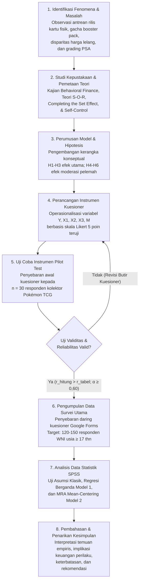

# BAB III
# METODE PENELITIAN

## 3.1 Jenis dan Sumber Data

Penelitian ini menggunakan pendekatan kuantitatif asosiatif dengan desain survei *cross-sectional*. Pendekatan kuantitatif dipilih karena penelitian ini menguji hipotesis empiris mengenai hubungan struktural antarvariabel yang telah dirumuskan berdasarkan kajian teoritis. Desain survei *cross-sectional* digunakan karena pengumpulan data primer dilakukan pada satu titik periode waktu tertentu secara serentak kepada sampel responden untuk menggambarkan fenomena yang diteliti (Sekaran & Bougie, 2016).

Data primer diperoleh langsung dari responden melalui penyebaran instrumen kuesioner daring (*online questionnaire*) berbasis Google Forms. Kuesioner dirancang menggunakan pertanyaan tertutup berskala Likert 5 poin (Sugiyono, 2019), sebagaimana disajikan pada Tabel 3.1:

**Tabel 3.1 Skala Pengukuran Likert 5 Poin**

| Skor | Pernyataan Sikap | Singkatan |
| :---: | :--- | :---: |
| 1 | Sangat Tidak Setuju | STS |
| 2 | Tidak Setuju | TS |
| 3 | Netral / Ragu-ragu | N |
| 4 | Setuju | S |
| 5 | Sangat Setuju | SS |

*Sumber: Dikembangkan dari Sugiyono (2019) untuk instrumen kuesioner penelitian, 2026.*

Data sekunder diperoleh melalui studi kepustakaan yang mencakup laporan resmi The Pokémon Company, data agregasi industri hiburan global, buku teks metodologi dan keuangan perilaku, serta artikel jurnal ilmiah nasional dan internasional bereputasi yang terindeks SINTA dan Scopus.

### 3.1.1 Batasan Penelitian dan Ruang Lingkup Operasional

Guna memastikan kejelasan ruang lingkup serta arah analisis yang terfokus, penelitian ini menetapkan batasan-batasan operasional sebagai berikut:

1. **Batasan Komoditas Objek:** Penelitian ini secara ketat dibatasi pada pembelian produk kemasan acak tertutup (*booster pack*) fisik resmi *Pokémon Trading Card Game* (Pokémon TCG) berbahasa Indonesia yang dirilis oleh The Pokémon Company / AKG Games. Penelitian ini tidak meneliti kartu permainan digital (seperti *Pokémon TCG Live* atau *Pokémon TCG Pocket*) maupun produk kartu dari waralaba lain (*Yu-Gi-Oh!*, *Magic: The Gathering*, atau *One Piece Card Game*).
2. **Batasan Responden:** Subjek penelitian dibatasi pada konsumen dan kolektor Warga Negara Indonesia (WNI) yang berdomisili di Indonesia, berusia minimal 17 tahun, dan memiliki riwayat pembelian aktif *booster pack* fisik dalam 6 hingga 12 bulan terakhir.
3. **Batasan Konseptual dan Metodologis:** Variabel yang diteliti dibatasi pada pengaruh tiga variabel independen (*Hedonic Motivation*, *Desire for Completeness*, dan *Speculative Motive*) terhadap satu variabel dependen (*Impulsive Buying*) dengan satu variabel moderasi (*Self-Control*), yang diestimasi menggunakan teknik regresi moderasi (*Moderated Regression Analysis* / MRA) berbantuan perangkat lunak IBM SPSS Statistics.

---

## 3.2 Populasi dan Sampel

### 3.2.1 Populasi dan Identifikasi Sumber Komunitas

Populasi dalam penelitian ini didefinisikan sebagai seluruh konsumen atau kolektor kartu fisik Pokémon Trading Card Game resmi berbahasa Indonesia di wilayah Republik Indonesia. Populasi ini diklasifikasikan sebagai populasi tidak terbatas (*infinite / unknown population*) karena jumlah pasti seluruh pembeli kartu di Indonesia tidak dapat diketahui secara persis akibat luasnya jaringan distribusi minimarket modern di seluruh pelosok Nusantara.

Keberadaan dan identifikasi populasi sasaran dalam penelitian ini bersumber dari ekosistem nyata komunitas TCG di Indonesia:

1. **Komunitas Toko Hobi Resmi (*Local Game Stores* / LGS):** Jaringan komunitas pemain dan kolektor terdaftar yang aktif berkegiatan di toko hobi resmi mitra AKG Games di wilayah Jabodetabek, Bandung, Surabaya, Yogyakarta, Medan, dan kota-kota besar lainnya.
2. **Komunitas Digital Berskala Nasional:** Grup komunitas daring aktif, antara lain grup Facebook *Pokémon TCG Indonesia* (dengan puluhan ribu anggota aktif), server Discord komunitas pemain kartu Indonesia, serta grup lelang dan jual-beli kartu di WhatsApp dan Telegram.
3. **Peserta Turnamen Resmi:** Komunitas pemain yang berpartisipasi dalam ajang kompetisi resmi seperti *Town League* dan *Regional League* yang diselenggarakan secara berkala di Indonesia.

### 3.2.2 Sampel dan Justifikasi Kriteria Inklusi

Penarikan sampel dilakukan dengan teknik sampel bertujuan (*purposive sampling*). Responden yang dipilih wajib memenuhi kriteria inklusi dengan justifikasi ilmiah sebagai berikut:

1. **Warga Negara Indonesia (WNI) dan Berdomisili di Indonesia:** Menjamin bahwa responden mengalami langsung dinamika ketersediaan produk kartu resmi berbahasa Indonesia serta struktur harga ritel dan pasar sekunder domestik.
2. **Berusia Minimal 17 Tahun pada Saat Pengisian Kuesioner:**
   * *Aspek Kedewasaan Administratif dan Hak Sipil:* Berdasarkan Undang-Undang Republik Indonesia Nomor 24 Tahun 2013 tentang Perubahan atas Undang-Undang Nomor 23 Tahun 2006 tentang Administrasi Kependudukan, batas usia 17 tahun menandai kepemilikan Kartu Tanda Penduduk (KTP) sebagai bukti identitas kedewasaan administratif dan hak sipil di Indonesia. Pada usia ini, responden dipandang telah memiliki kecakapan hukum mandiri untuk memberikan persetujuan partisipasi penelitian (*informed consent*) secara sadar dan sukarela tanpa memerlukan perwalian.
   * *Diskresi Keuangan Mandiri:* Pada usia 17 tahun ke atas (umumnya berada pada jenjang pendidikan akhir SMA atau mahasiswa perguruan tinggi), individu telah memiliki alokasi diskresi keuangan pribadi (uang saku mandiri atau penghasilan kerja paruh waktu) yang dapat dibelanjakan secara independen di gerai kasir minimarket.
   * *Kapasitas Kognitif:* Memastikan kematangan kognitif responden dalam memahami butir-butir pernyataan kuesioner ilmiah secara objektif dan bertanggung jawab.
3. **Pernah Membeli *Booster Pack* Resmi Pokémon TCG Fisik Minimal 1 Kali dalam Kurun Waktu 6 Bulan Terakhir (Maksimal 12 Bulan Terakhir):**
   * *Menjamin Pengalaman Riil Konsumsi:* Memastikan responden benar-benar pernah mengalami proses pengambilan keputusan belanja di etalase toko dan merasakan sensasi membuka bungkus kartu (*pack opening thrill*).
   * *Meminimalkan Bias Ingatan Retrospektif (Recall Bias):* Rentang waktu 6–12 bulan merupakan standar baku dalam riset perilaku konsumen untuk memastikan bahwa memori kognitif dan luapan afektif saat bertransaksi masih tersimpan segar dalam ingatan responden, sehingga data yang dilaporkan memiliki akurasi tinggi.

### 3.2.3 Penentuan Ukuran Sampel

Penentuan ukuran sampel minimum dalam penelitian ini mengacu pada formula Green (1991) yang dirancang khusus untuk mendeteksi efek pada analisis regresi linear berganda:

* **Untuk pengujian model korelasi keseluruhan (*overall model*):**
  $$N \ge 50 + 8k$$
  Dengan $k = 7$ prediktor ($X_1, X_2, X_3, M, X_1 \cdot M, X_2 \cdot M, X_3 \cdot M$), maka:
  $$N \ge 50 + 8(7) = 50 + 56 = 106\text{ responden}$$

* **Untuk pengujian prediktor individual (*individual predictors*):**
  $$N \ge 104 + k$$
  $$N \ge 104 + 7 = 111\text{ responden}$$

Mengacu pada perhitungan formula Green (1991) di atas, ukuran sampel minimum absolut yang dipersyaratkan adalah 111 responden. Target sampel data bersih yang dapat dianalisis (*usable and analyzable sample*) dalam penelitian ini ditetapkan sebesar **120 hingga 150 responden**, di luar 30 responden yang dialokasikan khusus untuk uji coba instrumen kuesioner (*pilot testing*). Jumlah sampel 120–150 ini memenuhi kriteria Cohen (1988) untuk mencapai kekuatan uji statistik (*statistical power*) $\ge 0,80$ pada taraf signifikansi $\alpha = 0,05$ dengan asumsi ukuran efek sedang (*medium effect size*, $f^2 = 0,15$) pada estimasi model regresi utama.

### 3.2.4 Justifikasi Komparatif Pemilihan Teknik Sampling

Dalam literatur metodologi penelitian kuantitatif (Sekaran & Bougie, 2016; Sugiyono, 2019), metode pengambilan sampel terbagi ke dalam dua rumpun utama: *Probability Sampling* dan *Non-Probability Sampling*:

* *Probability Sampling* (seperti *Simple Random Sampling* atau *Stratified Random Sampling*) menuntut adanya kerangka sampling (*sampling frame*) yang memuat daftar lengkap seluruh anggota populasi. Pada penelitian ini, kerangka sampling sensus pembeli kartu Pokémon di Indonesia tidak tersedia secara terpusat, sehingga teknik probabilitas murni mustahil diterapkan secara akurat.
* Oleh karena itu, penelitian ini memilih rumpun *Non-Probability Sampling* dengan teknik spesifik **_Purposive Sampling_** (sampel bertujuan). Teknik ini memilih responden berdasarkan pertimbangan dan kriteria inklusi terdefinisi yang ditetapkan peneliti.

Pemilihan *purposive sampling* merupakan pendekatan yang paling tepat (*the most suitable*) karena menjamin bahwa data yang dikumpulkan berasal murni dari individu yang memiliki kualifikasi relevan (kolektor/pembeli aktif kartu Pokémon resmi berusia dewasa), sehingga data yang diperoleh memiliki validitas isi yang tinggi. Pendekatan *purposive sampling* pada komunitas hobi dan kartu koleksi ini sejalan dengan praktik riset terdahulu pada konteks barang koleksi dan komunitas hobi (Belk, 1995; Gao et al., 2014; Aryadi & Lingga, 2024).

---

## 3.3 Model Penelitian

Guna menguji hipotesis penelitian secara akurat dan mengisolasi efek moderasi murni terpisah dari efek langsung pemoderasi, penelitian ini mengadopsi prosedur regresi hirarkis *Moderated Regression Analysis* (MRA) berbasis OLS yang diestimasi dalam dua model bertahap (Aiken & West, 1991; Cohen, 1988; Hayes, 2018):

**Model 1 — Regresi Linear Berganda Hirarkis (Model Aditif Baseline / Efek Utama):**
$$Y = \alpha + \beta_1 X_1^* + \beta_2 X_2^* + \beta_3 X_3^* + \beta_4 M^* + e$$

**Model 2 — *Moderated Regression Analysis* / MRA (Model Interaksi Moderasi Penuh):**
$$Y = \alpha + \beta_1 X_1^* + \beta_2 X_2^* + \beta_3 X_3^* + \beta_4 M^* + \beta_5 (X_1^* \cdot M^*) + \beta_6 (X_2^* \cdot M^*) + \beta_7 (X_3^* \cdot M^*) + e$$

Di mana:
* $Y$ = Skor komposit *Impulsive Buying* (variabel dependen)
* $X_1^*, X_2^*, X_3^*$ = Skor prediktor terpusat (*mean-centered*): $X_i^* = X_i - \bar{X}_i$ untuk $i \in \{1, 2, 3\}$ (*Hedonic Motivation*, *Desire for Completeness*, dan *Speculative Motive*)
* $M^*$ = Skor variabel pemoderasi terpusat (*mean-centered*): $M^* = M - \bar{M}$ (*Self-Control*)
* $X_1^* \cdot M^*, X_2^* \cdot M^*, X_3^* \cdot M^*$ = Istilah perkalian interaksi pemoderasi (*interaction terms*)
* $\alpha$ = Nilai intersep konstan regresi
* $\beta_1, \beta_2, \beta_3$ = Koefisien regresi efek utama prediktor pada nilai rata-rata pemoderasi ($M^* = 0$)
* $\beta_4$ = Koefisien regresi efek langsung pemoderasi (*Self-Control*) terhadap $Y$
* $\beta_5, \beta_6, \beta_7$ = Koefisien regresi interaksi moderasi (H4, H5, H6)
* $e$ = *Error term* (residual pengganggu)

Penyertaan $M^*$ pada Model 1 sebagai garis dasar aditif (*additive baseline*) menjamin bahwa peningkatan koefisien determinasi ($\Delta R^2 = R^2_{\text{Model 2}} - R^2_{\text{Model 1}}$) murni mengisolasi kontribusi penjelas tambahan dari ketiga variabel interaksi moderasi, yang diuji secara simultan melalui statistik $F_{\text{change}}$:
$$F_{\text{change}} = \frac{(R^2_{\text{Model 2}} - R^2_{\text{Model 1}}) / 3}{(1 - R^2_{\text{Model 2}}) / (N - 8)}$$
dengan derajat kebebasan $df_1 = 3$ dan $df_2 = N - 8$.

```
                    PENGARUH LANGSUNG
     ┌─────────────────────────────────────────────────────────┐
     │                                                         │
     │   [ X1: Hedonic Motivation     ] ──── H1 (+) ────┐      │
     │                                                   │      │
     │   [ X2: Desire for Completeness] ──── H2 (+) ────┼──►  [ Y: Impulsive Buying ]
     │                                                   │      │
     │   [ X3: Speculative Motive     ] ──── H3 (+) ────┘      │
     │                                                         │
     └─────────────────────────────────────────────────────────┘
                                                         ▲
                                                         │
                              H4, H5, H6 (Memperlemah / -)
                                                         │
                                            [ M: Self-Control ]
                                            (Variabel Moderasi)
```

---

## 3.4 Operasionalisasi Variabel

Operasionalisasi variabel menyajikan definisi operasional, dimensi, butir indikator kuesioner, dan skala pengukuran yang diadopsi dari instrumen baku teruji:

**Tabel 3.2 Operasionalisasi Variabel Penelitian**

### A. Variabel Dependen: *Impulsive Buying* ($Y$)
*Definisi Operasional:* Kecenderungan membeli *booster pack* kartu Pokémon TCG secara mendadak, tanpa pertimbangan anggaran keuangan sebelumnya, dan didorong oleh luapan dorongan afektif sesaat (Rook, 1987; Verplanken & Herabadi, 2001).

| Dimensi | Indikator Butir Kuesioner | Skala |
| :--- | :--- | :---: |
| Kognitif | Y1. Saya sering membeli *booster pack* kartu Pokémon tanpa perencanaan sebelumnya. | Likert 1–5 |
| Kognitif | Y2. Saya tidak terlalu memikirkan konsekuensi finansial saat membeli *booster pack* kartu Pokémon. | Likert 1–5 |
| Afektif | Y3. Saya merasa terdorong kuat untuk membeli *booster pack* kartu Pokémon saat melihatnya di kasir toko. | Likert 1–5 |
| Afektif | Y4. Saya merasa senang dan bersemangat saat membeli *booster pack* kartu Pokémon secara spontan. | Likert 1–5 |
| Kognitif | Y5. Saya sering membeli lebih banyak *booster pack* kartu Pokémon dari yang saya rencanakan sebelumnya. | Likert 1–5 |
| Afektif | Y6. Saya sulit menahan diri untuk tidak membeli *booster pack* kartu Pokémon ketika melihat stok tersedia di toko. | Likert 1–5 |

*Sumber Adaptasi:* Diadaptasi dari *Impulsive Buying Tendency Scale* (IBTS) Verplanken & Herabadi (2001) dan Rook & Fisher (1995).

### B. Variabel Independen 1: *Hedonic Motivation* ($X_1$)
*Definisi Operasional:* Motivasi berbelanja *booster pack* kartu Pokémon TCG untuk mendapatkan kesenangan emosional, sensasi kejutan, dan hiburan psikologis (Arnold & Reynolds, 2003; Babin et al., 1994).

| Dimensi | Indikator Butir Kuesioner | Skala |
| :--- | :--- | :---: |
| Petualangan (*Adventure*) | X1.1. Saya merasa berpetualang dan tertantang saat membeli dan membuka *booster pack* kartu Pokémon. | Likert 1–5 |
| Petualangan (*Adventure*) | X1.2. Pengalaman membuka kemasan acak *booster pack* kartu Pokémon memberikan sensasi kejutan yang menyenangkan bagi saya. | Likert 1–5 |
| Sosial (*Social*) | X1.3. Berbelanja kartu Pokémon mempererat ikatan dan kebersamaan dengan sesama teman sehobi. | Likert 1–5 |
| Peran (*Role*) | X1.4. Saya menikmati berbelanja kartu Pokémon untuk dihadiahkan atau dimainkan bersama teman dan keluarga sehobi. | Likert 1–5 |
| Eksplorasi Ide (*Idea*) | X1.5. Saya senang mengikuti rilis seri ekspansi kartu Pokémon terbaru dan inovasi desain terbarunya. | Likert 1–5 |

*Sumber Adaptasi:* Diadaptasi dari *Hedonic Shopping Motivation Scale* Arnold & Reynolds (2003) dan Gültekin & Özer (2012).

### C. Variabel Independen 2: *Desire for Completeness* ($X_2$)
*Definisi Operasional:* Dorongan psikologis dan motivasi internal kolektor untuk menuntaskan dan mengisi seluruh nomor slot kartu yang masih kosong dalam satu set binder koleksi Pokémon TCG (Gao et al., 2014; Barasz et al., 2017).

| Dimensi | Indikator Butir Kuesioner | Skala |
| :--- | :--- | :---: |
| Ketegangan Kognitif (*Tension*) | X2.1. Saya merasa tidak nyaman dan terganggu ketika album binder koleksi kartu Pokémon saya masih memiliki slot kartu kosong. | Likert 1–5 |
| Hasrat Penuntasan (*Closure*) | X2.2. Hasrat melengkapi seluruh seri kartu dalam binder mendorong saya untuk terus menambah koleksi. | Likert 1–5 |
| Ketegangan Kognitif (*Tension*) | X2.3. Mengetahui ada nomor kartu yang belum saya miliki dalam suatu seri membuat saya berhasrat untuk segera mendapatkannya. | Likert 1–5 |
| Rasa Keutuhan (*Wholeness*) | X2.4. Melengkapi satu set penuh koleksi kartu Pokémon memberikan perasaan kepuasan, kebanggaan, dan keutuhan bagi saya. | Likert 1–5 |
| Hasrat Penuntasan (*Closure*) | X2.5. Semakin sedikit kartu yang kurang dalam satu seri koleksi, semakin kuat desakan psikologis saya untuk menuntaskannya. | Likert 1–5 |

*Sumber Adaptasi:* Diadaptasi dari prinsip *The Completing the Set Effect* Gao et al. (2014), Barasz et al. (2017), dan Belk (1995).

### D. Variabel Independen 3: *Speculative Motive* ($X_3$)
*Definisi Operasional:* Pertimbangan potensi apresiasi harga pasar sekunder, prospek sertifikasi grading, dan ekspektasi memperoleh keuntungan modal (*capital gain*) dari penjualan kembali kartu langka (Shiller, 2000; Baur et al., 2018; Colline, 2024).

| Dimensi | Indikator Butir Kuesioner | Skala |
| :--- | :--- | :---: |
| Apresiasi Modal | X3.1. Saya membeli kartu dengan ekspektasi menarik kartu langka bernilai jual tinggi. | Likert 1–5 |
| Likuiditas | X3.2. Saya yakin kartu Pokémon langka memiliki likuiditas tinggi sehingga mudah dan cepat dijual kembali menjadi uang tunai di pasar sekunder. | Likert 1–5 |
| Tren Nilai | X3.3. Saya memandang kartu Pokémon langka sebagai aset alternatif yang nilainya dapat naik di masa depan. | Likert 1–5 |
| Potensi Laba | X3.4. Saya memandang modal membeli beberapa *pack* sebanding dengan potensi laba kartu langka. | Likert 1–5 |
| Penilaian Kondisi | X3.5. Saya memeriksa kondisi fisik kartu (potensi grading tinggi) untuk memaksimalkan harga jual kembali. | Likert 1–5 |

*Sumber Adaptasi:* Diadaptasi dari Shiller (2000), Baur et al. (2018), Colline (2024), dan Chen et al. (2021).

### E. Variabel Moderasi: *Self-Control* ($M$)
*Definisi Operasional:* Kapasitas volisional individu untuk menolak godaan belanja spontan, menunda kepuasan sesaat (*delay of gratification*), dan mendisiplinkan pengeluaran agar selaras dengan rencana keuangan pribadi (Tangney et al., 2004; Sultan et al., 2012).

| Dimensi | Indikator Butir Kuesioner | Skala |
| :--- | :--- | :---: |
| Tahan Godaan | M1. Saya mampu menolak godaan berbelanja barang yang tidak direncanakan. | Likert 1–5 |
| Tunda Kepuasan | M2. Saya mampu menunda keinginan membeli sesuatu sampai waktu yang tepat. | Likert 1–5 |
| Taat Anggaran | M3. Saya tetap mematuhi batas anggaran yang telah saya tetapkan. | Likert 1–5 |
| Pertimbangan Konsekuensi | M4. Saya memikirkan konsekuensi jangka panjang sebelum membelanjakan uang. | Likert 1–5 |
| Pengendalian Impuls | M5. Saya dapat mengendalikan diri dari desakan membeli barang secara spontan. | Likert 1–5 |
| Kontrol Diri Global | M6. Secara umum, saya adalah pribadi yang memiliki pengendalian diri yang kuat. | Likert 1–5 |

*Sumber Adaptasi:* Diadaptasi dari *Brief Self-Control Scale* (BSCS) Tangney et al. (2004), Vohs & Faber (2007), dan Sultan et al. (2012).

---

## 3.5 Metode Analisis Data

### 3.5.1 Justifikasi Komparatif Pemilihan Metode Analisis

Dalam pengujian model penelitian kuantitatif eksplanatori yang melibatkan efek moderasi, terdapat beberapa alternatif metode analisis dalam literatur statistik:

1. **_Structural Equation Modeling_ (SEM) Berbasis Kovarians (SEM-CB) atau Varian (SEM-PLS):** Cocok untuk model bertingkat dengan konstruk laten kompleks dan variabel mediasi simultan. Namun, SEM-CB menuntut asumsi distribusi normal multivariat yang sangat ketat serta ukuran sampel besar ($N > 200$), sedangkan SEM-PLS lebih ditujukan untuk pemodelan prediktif eksploratif (Hair et al., 2019).
2. **_Moderated Regression Analysis_ (MRA) Berbasis _Ordinary Least Squares_ (OLS):** Merupakan metode klasik dan baku yang dirancang khusus untuk menguji apakah kekuatan atau arah hubungan antara variabel independen dan dependen dipengaruhi oleh variabel pemoderasi kuantitatif (Aiken & West, 1991; Hayes, 2018; Ghozali, 2018).

Penelitian ini menetapkan bahwa **MRA berbasis OLS berbantuan IBM SPSS Statistics** adalah metode yang **paling cocok (_the most suitable_)**, dengan pertimbangan metodologis sebagai berikut:
* Seluruh variabel penelitian diukur menggunakan skala komposit teruji dengan indikator-indikator yang terdefinisi secara terfokus.
* Ukuran sampel penelitian (120–150 responden) berada pada rentang yang sangat ideal dan kokoh untuk OLS, tanpa menimbulkan risiko estimasi berlebih (*over-parameterization*) yang sering terjadi pada SEM (Hair et al., 2019).
* Prosedur *mean-centering* ($X_i^* = X_i - \bar{X}_i$; $M^* = M - \bar{M}$) yang diterapkan memfasilitasi interpretasi koefisien serta mereduksi multikolinearitas non-esensial antara variabel prediktor dengan produk interaksinya (Aiken & West, 1991; Hayes, 2018).
* Metode ini telah terbukti secara luas dan diadopsi oleh banyak penelitian bereputasi dalam menguji moderasi kontrol diri terhadap perilaku pembelian impulsif (Sultan et al., 2012; Apidana & Kholifah, 2022; Lienardy & Panasea, 2024; Artadita & Firmialy, 2024).

### 3.5.2 Penyusunan Skor Komposit dan Uji Kualitas Data

Skor masing-masing variabel penelitian dibentuk melalui penghitungan nilai rata-rata (*mean composite*) dari seluruh butir pernyataan indikator yang valid pada variabel bersangkutan. Seluruh butir kuesioner dikodekan secara searah dan positif (skor 5 menunjukkan tingkatan konstruk tertinggi). Sebelum pengujian model regresi, instrumen dievaluasi melalui:
* **Uji Validitas Butir:** Menggunakan teknik korelasi butir-total (*Pearson Product Moment / corrected item-total correlation*) terhadap skor komposit konstruk yang dituju. Suatu butir pernyataan kuesioner dinyatakan valid jika nilai $r_{\text{hitung}} > r_{\text{tabel}}$ pada tingkat signifikansi $\alpha = 0,05$ untuk uji dua sisi.
* **Uji Reliabilitas Konsistensi Internal:** Menggunakan koefisien *Cronbach's Alpha*. Seluruh konstruk penelitian dinyatakan reliabel dan memiliki konsistensi internal memadai jika nilai *Cronbach's Alpha* $\ge 0,60$ (Ghozali, 2018; Sekaran & Bougie, 2016).

### 3.5.3 Uji Asumsi Klasik

Untuk memastikan terpenuhinya prasyarat estimasi regresi OLS agar parameter penduga bersifat tidak bias dan konsisten dalam pengujian hipotesis:

1. **Uji Normalitas Residual:** Menguji apakah residual model berdistribusi normal menggunakan uji statistik non-parametrik *One-Sample Kolmogorov-Smirnov*, dengan kriteria residual berdistribusi normal jika nilai signifikansi asimtotik $p > 0,05$.
2. **Uji Multikolinearitas:** Memastikan ketiadaan hubungan linear sempurna antarvariabel independen dengan memeriksa nilai *Tolerance* ($> 0,10$) dan nilai *Variance Inflation Factor* (VIF $< 10$).
3. **Uji Heteroskedastisitas:** Menguji kesamaan varians residual melalui uji Glejser, di mana model dinyatakan bebas heteroskedastisitas apabila nilai signifikansi parameter terhadap nilai absolut residual $p > 0,05$.

*Catatan metodologis:* Uji autokorelasi (seperti uji Durbin-Watson) sengaja tidak dilakukan karena pengujian autokorelasi secara teoritis hanya relevan untuk data runtun waktu (*time-series*) atau data panel berurutan, bukan untuk survei *cross-sectional* primer (Ghozali, 2018).

### 3.5.4 Estimasi Regresi Hirarkis dan MRA

Analisis regresi dilakukan dalam dua tahapan hirarkis berurutan:
1. **Tahap 1 (Model 1 Aditif Baseline):** Mengestimasi efek utama ketiga variabel anteseden terpusat ($X_1^*, X_2^*, X_3^*$) beserta efek langsung variabel pemoderasi terpusat ($M^*$) terhadap $Y$.
2. **Tahap 2 (Model 2 Interaksi Penuh MRA):** Memasukkan blok tiga istilah interaksi terpusat ($X_1^* \cdot M^*, X_2^* \cdot M^*, X_3^* \cdot M^*$) untuk menguji efek moderasi kontrol diri secara simultan dan parsial.

### 3.5.5 Uji Koefisien Determinasi ($R^2$) dan Uji F Perubahan

Evaluasi kecocokan model dilakukan dengan memeriksa nilai *Adjusted* $R^2$ pada Model 1 dan Model 2. Kontribusi penjelas murni dari blok variabel moderasi dibuktikan melalui nilai peningkatan koefisien determinasi ($\Delta R^2 = R^2_{\text{Model 2}} - R^2_{\text{Model 1}}$) yang diuji signifikansinya menggunakan statistik $F_{\text{change}}$ pada taraf signifikansi $p < 0,05$.

### 3.5.6 Uji Hipotesis dan Analisis Kemiringan Bersyarat (*Simple Slopes*)

* **Uji Statistik t (Uji Parsial):** Menguji signifikansi pengaruh masing-masing koefisien regresi secara individual pada taraf $\alpha = 0,05$. Hipotesis didukung jika nilai signifikansi $p < 0,05$ dan arah koefisien sejalan dengan arah hipotesis. Koefisien $\beta_1, \beta_2, \beta_3$ pada Model 2 merefleksikan pengaruh utama pada rata-rata kontrol diri ($M^* = 0$).
* **Uji Statistik F (Uji Kelayakan Model):** Menguji kelayakan model regresi secara simultan pada taraf signifikansi $p < 0,05$.
* **Analisis Kemiringan Bersyarat (*Simple Slopes Analysis*):** Untuk hipotesis moderasi (H4, H5, H6), efek peredaman dibuktikan dengan mengevaluasi kemiringan bersyarat $\frac{\partial Y}{\partial X_i^*} = \beta_i + \beta_{\text{int}} M^*$ pada tingkat kontrol diri rendah ($-1\,\text{SD}$), rata-rata ($0\,\text{SD}$), dan tinggi ($+1\,\text{SD}$). Efek moderasi yang memperlemah terbukti jika kemiringan pengaruh $X_i$ terhadap $Y$ semakin mendatar pada tingkat kontrol diri tinggi (Aiken & West, 1991; Hayes, 2018).

---

## 3.6 Diagram Alur Pelaksanaan Penelitian

Tahapan pelaksanaan penelitian ini dari awal perumusan gagasan hingga penarikan kesimpulan disajikan secara skematis pada Gambar 3.1:



**Gambar 3.1. Diagram Alur Pelaksanaan Penelitian**
*Sumber: Dikembangkan oleh penulis untuk tahapan operasional penelitian, 2026.*

---

## 3.7 Jadwal Pelaksanaan Penelitian

Jadwal pelaksanaan tahapan kegiatan penelitian direncanakan berlangsung selama 6 (enam) bulan kalender, sebagaimana dirangkum pada Tabel 3.3:

**Tabel 3.3. Jadwal Pelaksanaan Kegiatan Penelitian (Tahun 2026)**

| No | Tahapan Kegiatan Penelitian | B1 | B2 | B3 | B4 | B5 | B6 |
| :---: | :--- | :---: | :---: | :---: | :---: | :---: | :---: |
| 1 | Identifikasi fenomena pasar dan perumusan topik | • | | | | | |
| 2 | Studi kepustakaan dan telaah literatur jurnal | • | • | | | | |
| 3 | Penyusunan naskah proposal penelitian (Bab 1–3) | | • | • | | | |
| 4 | Bimbingan intensif dan revisi proposal skripsi | | • | • | | | |
| 5 | Pelaksanaan Seminar Proposal Skripsi | | | • | | | |
| 6 | Uji coba instrumen kuesioner (*pilot test* $n = 30$) | | | | • | | |
| 7 | Pengumpulan data lapangan survei utama ($n = 120$–$150$) | | | | • | • | |
| 8 | Tabulasi data dan pengolahan statistik via SPSS | | | | | • | |
| 9 | Penyusunan laporan Bab 4 (Analisis) dan Bab 5 (Penutup) | | | | | • | • |
| 10 | Ujian Sidang Skripsi dan Komprehensif | | | | | | • |

*Keterangan: B1 = Bulan ke-1; B2 = Bulan ke-2; B3 = Bulan ke-3; B4 = Bulan ke-4; B5 = Bulan ke-5; B6 = Bulan ke-6 tahun akademik 2026.*
