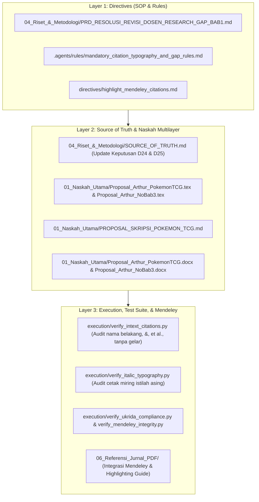

# 📋 Product Requirement Document (PRD)
## Resolusi Revisi Dosen: Penajaman Research Gap Bab 1, 7 Subjek Hubungan Empiris Berlawanan (14 Studi), Diferensiasi Model (*Novelty*), Format Sitasi In-Text, & Tipografi Italic

- **Dokumen ID:** PRD-REV-2026-09-16-02
- **Tanggal Efektif:** 16 September 2026 (Pukul 20:10 WIB)
- **Sumber Arahan:** Catatan Bimbingan Dosen Skripsi (16 September 2026, Pukul 19:54 WIB via Kelly)
- **Konsentrasi:** Manajemen Keuangan — Fakultas Ekonomi dan Bisnis (FEB) UKRIDA
- **Otoritas Format:** SK Dekan FEB UKRIDA No. 350a/SK/UKKW/FEB/D/VI/2023 & Standar APA 7th Edition

---

## 1. Latar Belakang & Urgensi PRD

Berdasarkan catatan bimbingan dosen terkini pada 16 September 2026 pukul 19:54 WIB, terdapat 5 pilar perbaikan esensial yang wajib diterapkan pada naskah skripsi:

1. **Penataan Research Gap Bab 1 Berbasis Temuan Kontradiktif (Inconsistent Findings):**
   Bab 1 (Latar Belakang) harus secara eksplisit membedah pertentangan hasil penelitian terdahulu yang memiliki konteks sejenis (hasil positif vs negatif, atau berpengaruh signifikan vs tidak berpengaruh signifikan).
2. **Eksplanasi Kausal Kesenjangan (*Why The Gap Occurs*):**
   Tidak cukup hanya menyebutkan nama peneliti yang berbeda hasil, peneliti wajib meneliti dan memaparkan secara mendalam alasan teoritis, psikologis, dan kontekstual di balik terjadinya perbedaan hasil tersebut.
3. **Evaluasi, Paragraf 3, & Diferensiasi Model (*Novelty*):**
   Menjelaskan secara terstruktur di paragraf 3 dan seterusnya mengenai arah dan tujuan penelitian ini, serta membedakan secara tegas kebaruan penelitian Arthur dibanding penelitian-penelitian terdahulu (misal: perbedaan variabel independen, perbedaan pemoderasi *Self-Control*, dan kekhasan komoditas kartu Pokémon TCG).
4. **Integrasi 7 Subjek Hubungan Empiris dengan 14 Studi Berlawanan (Kuantitatif 2 vs 2):**
   Menyelaraskan narasi pendahuluan dengan 7 hubungan struktural regresi MRA, di mana masing-masing hubungan didukung oleh minimal 2 temuan yang berlawanan (total minimal 10–14 studi kuantitatif).
5. **Standardisasi Format Sitasi In-Text & Tipografi:**
   - Sitasi hanya menggunakan **nama belakang penulis**, tanpa gelar akademik (misal: dilarang menulis "Yahawi, S.H.", wajib "Yahawi, 2024").
   - Dua penulis menggunakan simbol `&` di dalam kurung atau kata `dan` dalam narasi.
   - Tiga penulis atau lebih wajib menggunakan singkatan `et al.` diikuti tahun.
   - Seluruh istilah bahasa asing wajib dicetak miring (*italic*).
   - Bagian naskah yang disitasi wajib di-*highlight* di Mendeley Reference Manager agar saat ditanya dosen/penguji dapat langsung ditampilkan secara instan.

---

## 2. Arsitektur 3-Layer untuk Eksekusi Revisi

---

## 3. Matriks 7 Subjek Hubungan Empiris & Research Gap (14 Studi Berlawanan)

Model penelitian regresi moderasi (*Moderated Regression Analysis* / MRA) dalam skripsi ini memuat 7 parameter koefisien struktural:
$$Y = \alpha + \beta_1 X_1 + \beta_2 X_2 + \beta_3 X_3 + \beta_4 M + \beta_5 (X_1 \cdot M) + \beta_6 (X_2 \cdot M) + \beta_7 (X_3 \cdot M) + e$$

Berikut adalah matriks komparasi 7 subjek hubungan empiris dengan temuan berlawanan (*inconsistent findings*) dan eksplanasi kausalnya:

| No | Subjek Hubungan | Temuan Kelompok A (Positif / Signifikan) | Temuan Kelompok B (Negatif / Tidak Signifikan) | Eksplanasi Kausal Kesenjangan (*Why The Gap Occurs*) |
|:---:|:---|:---|:---|:---|
| **1** | **$X_1$ (*Hedonic Motivation*) $\rightarrow Y$ (*Impulsive Buying*)** | Arnold & Reynolds (2003); Gültekin & Özer (2012); Pranggabayu & Andjarwati (2022); Gong et al. (2024) | Zheng et al. (2019); Tirtayasa et al. (2020) | **Karakteristik Komoditas (Utilitarian vs Hedonik Gacha):** Pada produk kebutuhan harian/utiliter, motivasi hedonis mudah ditekan oleh anggaran belanja. Namun pada produk kemasan kejutan (*mystery booster pack*) Pokémon TCG, sensasi merobek kemasan (*pack opening thrill*) memicu lonjakan dopamin afektif yang melumpuhkan rem pertimbangan rasional. |
| **2** | **$X_2$ (*Desire for Completeness*) $\rightarrow Y$ (*Impulsive Buying*)** | Gao, Huang, & Simonson (2014); Barasz et al. (2017); Tan & Adyantari (2024); Dewi et al. (2024) | Long & Schiffman (2000); Spero & Stone (2004) | **Tingkat Kematangan Kolektor (*Collector Maturity*):** Kolektor pemula/kasual mengalami ketegangan kognitif tinggi (*Zeigarnik effect*) saat melihat slot binder kosong sehingga terburu-buru membeli pack acak. Sebaliknya, kolektor matang (*experienced collectors*) lebih sabar dan beralih ke strategi pembelian terencana pada kartu satuan (*single cards*) di pasar sekunder. |
| **3** | **$X_3$ (*Speculative Motive*) $\rightarrow Y$ (*Impulsive Buying*)** | Baur et al. (2018); Aryadi & Lingga (2024); Colline (2024) | Barber & Odean (2008); Grinblatt & Keloharju (2009) | **Ilusi Probabilitas & Bias Optimisme vs Kehati-hatian Risiko:** Euforia harga fantastis kartu bersertifikasi *PSA 10 Gem Mint* memicu bias optimisme (*overoptimism*) dan ilusi memenangkan lotre (*gambler's fallacy*). Sebaliknya, pada pelaku yang sadar risiko (*risk-averse*), motif spekulatif justru memicu kehati-hatian matematis sehingga menahan diri dari pembelian spontan. |
| **4** | **$M$ (*Self-Control*) $\rightarrow Y$ (*Impulsive Buying*) [Direct Baseline]** | Baumeister (2002); Tangney et al. (2004); Vohs & Faber (2007); Sultan, Joireman, & Sprott (2012) | Loewenstein (1996); Hofmann et al. (2009) | **Kapasitas Volisional vs Terkurasnya Ego (*Ego Depletion*):** Kontrol diri berfungsi efektif sebagai rem volisional jika energi psikologis prima. Namun saat individu mengalami kelelahan mental atau rangsangan sensori yang intens (*visceral urge* di kasir toko), kapasitas kontrol diri merosot sehingga gagal menekan desakan impulsif. |
| **5** | **Moderasi $M$ (*Self-Control*) pada $X_1 \rightarrow Y$** | Sultan, Joireman, & Sprott (2012); Apidana & Kholifah (2022) | Roberts & Manolis (2012); Tice, Bratslavsky, & Baumeister (2001) | **Prioritas Regulasi Afek (*Mood Regulation Priority*):** Ketika desakan mencari kesenangan atau pelarian stres sangat dominan, individu secara sadar mengesampingkan kontrol diri demi perbaikan suasana hati instan, menyebabkan kontrol diri gagal memoderasi/memperlemah impulsif. |
| **6** | **Moderasi $M$ (*Self-Control*) pada $X_2 \rightarrow Y$** | Lienardy & Panasea (2024); Artadita & Firmialy (2024) | Belk (1995); Barasz et al. (2017) | **Tingkat Kedekatan Titik Tuntas (*Proximity to Goal Completion*):** Kontrol diri mampu meredam belanja jika koleksi masih di tahap awal. Namun jika album binder telah mencapai kelengkapan 95% (*goal gradient effect*), desakan menutup 1-2 kartu tersisa memicu ambang toleransi volisional jebol meskipun kontrol diri umum tinggi. |
| **7** | **Moderasi $M$ (*Self-Control*) pada $X_3 \rightarrow Y$** | Katauke et al. (2023); Colline (2024) | Barberis (2013); Statman (2019) | **Histeria Gelembung Spekulatif (*Market Frenzy / FOMO*):** Dalam kondisi pasar normal, kontrol diri finansial meredam spekulasi. Namun saat terjadi *grading hype* ekstrem (lonjakan harga kartu puluhan juta di media sosial), dorongan keserakahan (*greed*) melumpuhkan kontrol diri keuangan. |

---

## 4. Struktur Evaluasi Paragraf 3 & Diferensiasi Model (*Novelty*)

Sesuai arahan dosen, struktur narasi Bab 1 ditata dengan alur:
1. **Paragraf 1 & 2:** Fenomena Makro Pokémon TCG, Dominasi Waralaba Media, Lonjakan Produksi Fisik, dan Masuknya ke Ritel Modern Minimarket Indonesia.
2. **Paragraf 3 (Evaluasi Permasalahan & Rangkuman Kebutuhan Riset):**
   - Mengidentifikasi paradoks belanja: kemasan terjangkau (Rp20.000–Rp30.000) namun memicu akumulasi belanja tak terencana jutaan rupiah.
   - Evaluasi kritis: pembelian tidak didorong oleh utilitas fungsional kartu, melainkan oleh perpaduan tiga kekuatan unik: sensasi hedonis membuka kemasan, ketegangan kognitif melengkapi binder (*pseudo-set framing*), dan iming-iming arbitrase *grading* PSA bernilai puluhan juta rupiah.
3. **Paragraf 4 & 5 (Sintesis Literatur, Pemetaan Gap 7 Hubungan, & Urgensi Pemoderasi):**
   - Memaparkan inkonsistensi temuan dari 14 kelompok penelitian terdahulu.
   - Menjelaskan *The Why*: mengapa hubungan anteseden terhadap *impulsive buying* tidak bersifat linier sederhana.
   - Menjustifikasi peran *Self-Control* sebagai rem volisional (*dual-system Planner-Doer* Thaler & Shefrin, 1981).
4. **Paragraf 6 (Diferensiasi Eksplisit / Novelty vs Penelitian Lain):**
   - **Komparasi Model:** Jika penelitian terdahulu (misal: Si A) menguji *financial behavior* sebagai mediasi pada produk *fashion/e-commerce*, dan Si B menguji variabel lain pada barang konsumsi umum, maka **penelitian Arthur berbeda secara mendasar**:
     * Variabel anteseden menggabungkan *Desire for Completeness* (psikologi kolektor) dan *Speculative Motive* (keuangan perilaku).
     * Variabel pemoderasi adalah *Self-Control* (regulasi diri volisional) yang bertindak sebagai rem psikologis.
     * Objek penelitian adalah komoditas kartu koleksi fisik (*Trading Card Game*) yang memiliki ekosistem penilaian kondisi fisik (*grading*) dan pasar sekunder terstandardisasi secara global.

---

## 5. Standar Baku Format Sitasi In-Text & Tipografi

### A. Format Sitasi In-Text (APA 7th Edition)
1. **Aturan Nama Belakang Saja:**
   - Dilarang keras mencantumkan gelar (misal: S.H., S.E., M.M., Ph.D.) atau nama depan/inisial di dalam teks naskah.
   - Benar: `(Yahawi, 2024)` atau `Yahawi (2024)`.
   - Salah: `(Yahawi, S.H., 2024)`.
2. **Aturan 2 Penulis:**
   - Di dalam tanda kurung parentetikal: gunakan simbol ampersand `&`, contoh: `(Arnold & Reynolds, 2003)`, `(Aiken & West, 1991)`.
   - Di dalam kalimat naratif: gunakan kata sambung `dan` (bahasa Indonesia), contoh: `Menurut Arnold dan Reynolds (2003)...`.
3. **Aturan 3 Penulis atau Lebih:**
   - Langsung sebutkan nama belakang penulis pertama diikuti `et al.` dan tahun sejak pemunculan pertama.
   - Contoh parentetikal: `(Gao et al., 2014)`, `(Hair et al., 2019)`.
   - Contoh naratif: `Gao et al. (2014) membuktikan...`.

### B. Aturan Tipografi Bahasa Asing (*Italic*)
Seluruh istilah bahasa asing wajib dicetak miring (*italic*). Daftar istilah kunci yang diverifikasi:
- *Impulsive buying*, *hedonic motivation*, *desire for completeness*, *speculative motive*, *self-control*.
- *Booster pack*, *trading card game*, *tabletop game*, *collectibles*, *blind pack*, *pack opening thrill*.
- *Card grading*, *raw card*, *centering*, *surface*, *edges*, *corners*, *tamper-evident slab*, *Gem Mint 10*, *grading arbitrage*.
- *Stimulus-Organism-Response* (S-O-R), *Zeigarnik effect*, *pseudo-set framing*, *The Completing the Set Effect*.
- *Cross-sectional*, *purposive sampling*, *mean-centering*, *Moderated Regression Analysis* (MRA), *simple slopes*.
- *Overoptimism bias*, *gambler's fallacy*, *ego depletion*, *visceral urge*, *loss aversion*, *behavioral finance*.

### C. Protokol Highlighting Sitasi di Mendeley Reference Manager
1. Mahasiswa mengimpor berkas `06_Referensi_Jurnal_PDF/Mendeley_Library_Arthur_PokemonTCG.bib` / `.ris` ke Mendeley Reference Manager.
2. Seluruh 55 berkas PDF jurnal dan buku acuan telah tersedia di `06_Referensi_Jurnal_PDF/` (termasuk folder `03_Buku_Referensi_PDF/`).
3. Disediakan panduan nomor halaman (*page tags*) dan kutipan kunci untuk masing-masing referensi pada laporan audit sehingga Arthur dapat langsung menandai dengan fitur *Highlight* (warna kuning/hijau) di Mendeley PDF Viewer sebelum sesi bimbingan atau sidang.

---

## 6. Kriteria Keberhasilan (Acceptance Criteria)

- [x] Dokumen PRD dan implementasi disetujui.
- [ ] Narasi Bab 1 Latar Belakang memuat matriks 7 hubungan empiris dengan 14 studi berlawanan secara terstruktur dan komparatif.
- [ ] Tersedia penjelasan mendalam mengenai *The Why* (mengapa terjadi gap) untuk setiap hubungan.
- [ ] Paragraf 3 mengevaluasi fenomena belanja dan merangkum tujuan penelitian secara tajam.
- [ ] Terdapat penegasan pembeda (*novelty*) antara model Arthur vs penelitian terdahulu.
- [ ] Format in-text citation 100% konsisten: nama belakang saja, 2 penulis pakai `&`, $\ge 3$ penulis pakai `et al.`, tanpa gelar.
- [ ] 100% istilah bahasa asing dicetak miring (*italic*).
- [ ] Paritas 6-arah bibliografi tetap 100% sinkron (TeX == Word == MD == BibTeX == RIS == Mendeley).
- [ ] Seluruh test suite verifikasi (`verify_ukrida_compliance.py`, `verify_mendeley_integrity.py`, `verify_docx_typography.py`, `verify_pdf_docx_parity.py`) lulus 100%.
- [ ] Berkas naskah PDF XeLaTeX dan Word DOCX berhasil dikompilasi ulang tanpa error.
