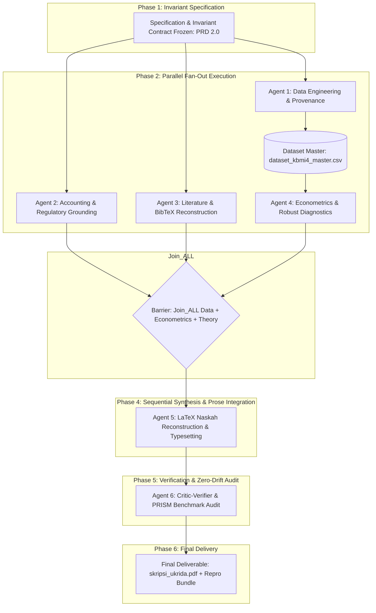

# Master Revision Plan: Graph of Agents (GoA) Orchestration
**Framework: Dynamic Directed Acyclic Graph (DAG) & Dual-Ledger Coordination**
*Proyek: Remediasi Skripsi KBMI 4 Green Financing | Tanggal: 30 Agustus 2026*

---

## 1. Multi-Agent Topology & DAG Workflow

Sistem eksekusi menggunakan arsitektur **Graph of Agents (GoA)** yang membagi beban kerja ke dalam 4 spesialis agen paralel (*Fan-Out*), disinkronkan melalui *Join Barrier*, dilanjutkan dengan sintesis naskah, audit verifikasi nol-drift (*Zero-Drift Audit*), dan kompilasi final.

---

## 2. Agent Roles & Detailed Work Packages

### Track 1: Agent Data Engineer (Data Provenance & Dataset Reconstruction)
- **Tugas:**
  1. Melakukan audit dan verifikasi 80 observasi (BBRI, BMRI, BBCA, BBNI 2021-Q1 s.d. 2025-Q4) terhadap laporan keuangan publikasi kuartalan dan sustainability report resmi.
  2. Menyusun berkas `dataset_kbmi4_master.csv` lengkap dengan kolom verifikasi: `Bank`, `Tahun`, `Kuartal`, `ROA_Annualized`, `NPL_Gross`, `CAR`, `Green_Financing_Ratio`, `Source_Doc`, `Page_Ref`.
  3. Memastikan definisi dan aturan pembentukan *Green Financing* terdokumentasi eksplisit.

### Track 2: Agent Econometrician (Panel Analysis & Diagnostic Suite)
- **Tugas:**
  1. Menjalankan pipeline regresi data panel lengkap: Uji Chow, Hausman, Lagrange Multiplier.
  2. Melakukan uji diagnostik komprehensif: Uji Normalitas Jarque-Bera (rumus terkalibrasi), Multikolinearitas (VIF pada matriks kovarians yang tepat), Heteroskedastisitas, Autokorelasi Serial Panel (Wooldridge test), dan Cross-Sectional Dependence (Pesaran CD test).
  3. Mengestimasi model terpilih dengan **Driscoll-Kraay Robust Standard Errors** untuk mengoreksi autokorelasi serial dan korelasi spasial.
  4. Menghitung *Adjusted* $R^2$ dengan derajat kebebasan yang benar ($NT - N - K$) serta uji Wald untuk hipotesis simultan ($\beta_1 = \beta_2 = \beta_3 = 0$).
  5. Menghasilkan tabel ringkasan ekonometrika untuk Bab 4 dan berkas skrip reproduksi.

### Track 3: Agent Accounting & Regulatory Specialist
- **Tugas:**
  1. Menyelaraskan tinjauan PSAK 71 / IFRS 9 dengan standar akuntansi yang berlaku (3-stage ECL, model probabilitas tertimbang, pemisahan jelas antara kolektibilitas BI/OJK dan staging PSAK).
  2. Memperbarui seluruh dasar regulasi perbankan: POJK 51/POJK.03/2017 (kewajiban pelaporan dan klausul audit), POJK 18/2023 (menggantikan POJK 60/2017), dan Taksonomi Keuangan Berkelanjutan Indonesia (TKBI 12 Kategori KUBL).

### Track 4: Agent Literature & Bibliographer
- **Tugas:**
  1. Memverifikasi seluruh 40+ referensi jurnal terhadap basis data CrossRef/Scopus/Google Scholar.
  2. Memperbaiki mismatch metadata (Cui et al. 2018, Chiaramonte et al. 2020, Yin et al. 2021).
  3. Membangun berkas `references.bib` yang valid dan menghubungkan seluruh sitasi menggunakan `\cite{...}`.

### Track 5: Agent LaTeX Lead Typesetter
- **Tugas:**
  1. Membersihkan naskah `skripsi_ukrida.tex` dari seluruh karakter rusak `?` dan error markup LaTeX.
  2. Mengintegrasikan narasi revisi Bab 1, Bab 2, Bab 3, Bab 4, dan Bab 5 dengan bahasa ilmiah yang presisi (menghapus klaim kausal berlebihan).
  3. Memperbaiki format tabel ke standar profesional *booktabs* dan memformat formula aljabar matriks.
  4. Mengisi seluruh identitas lembar pengesahan dan biodata.
  5. Mengkompilasi berkas PDF menggunakan `latexmk` / `pdflatex`.

---

## 3. Dual-Ledger Coordination System

Untuk menjaga transparansi dan keterlacakan eksekusi:

1. **Task Ledger (Strategic State):**
   - Mengelola status penyelesaian per milestone (Milestone 1 Data $\to$ Milestone 2 Ekonometrika $\to$ Milestone 3 Naskah $\to$ Milestone 4 Verifikasi).
2. **Progress Ledger (Turn-by-Turn Execution Traces):**
   - Mencatat setiap hasil eksekusi skrip, perbaikan baris kode LaTeX, nilai $t$-statistic baru, dan verifikasi kompilasi.

---

## 4. Barrier Policy & Conflict Resolution Matrix

- **Barrier Policy:** $\text{Join}_{\text{ALL}}$ — Sintesis naskah Bab 4 dan Bab 5 hanya dapat dimulai setelah Track Data dan Track Ekonometrika menghasilkan output final yang terkunci (*locked state*).
- **Conflict Resolution:** Jika terdapat perbedaan antara teori di Bab 2 dan hasil empiris di Bab 4, strategi resolusi yang digunakan adalah **Empirical Realism (Data-First)**: laporkan temuan empiris objektif di Bab 4, lalu bahas secara kritis di Bab 5 mengapa hipotesis tertentu mungkin tidak signifikan (misal: akibat masa adaptasi regulasi atau volatilitas makroekonomi pasca-pandemi).
